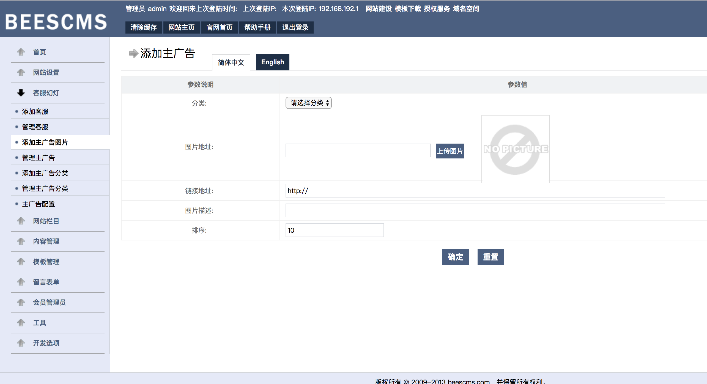
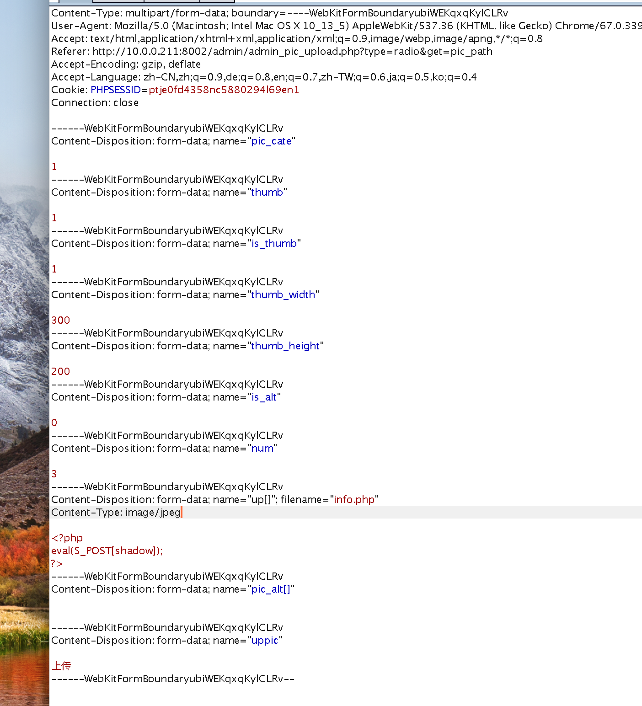
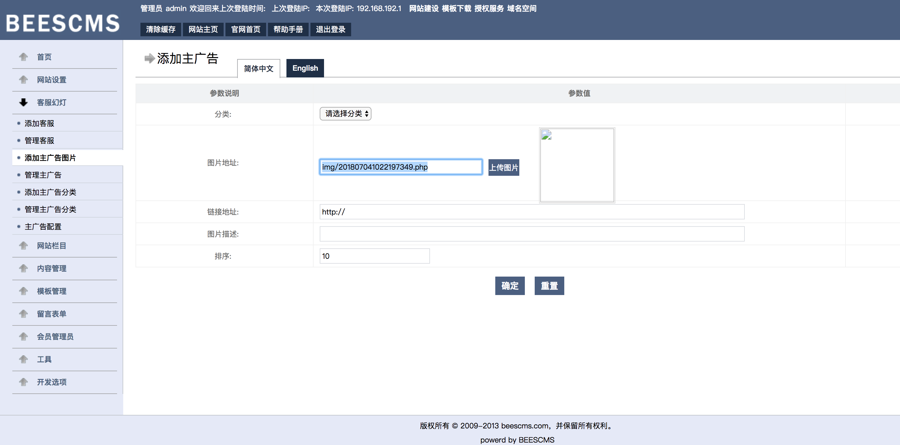
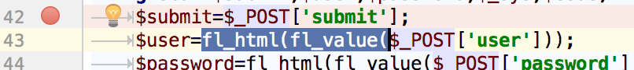
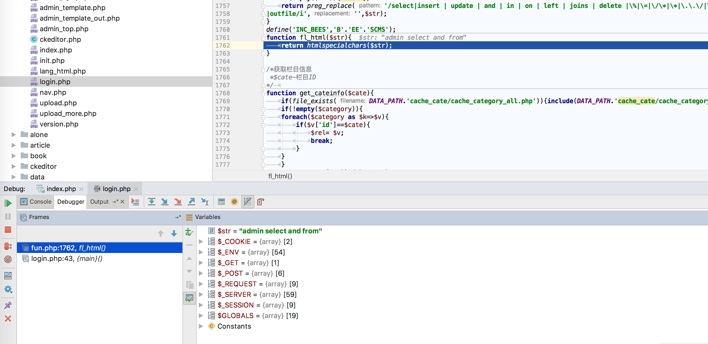

## 启动环境

```
docker-compose build
docker-compose up -d
```

## 0x01 系统内置木马

利用D盾扫描网站目录，在site/sitemap.php中存在后门


## 0x02 后台获取webshell

通过弱口令admin:admin进入http://127.0.0.1:8002/admin/admin.php后台
找到图片上传处

尝试是否可以上传wenshell，发现直接上传不行，尝试将content type改为image/jpeg,即可上传成功：


服务器会返回路径地址



[链接一](https://www.secpulse.com/archives/69910.html)
[链接二](https://www.anquanke.com/post/id/98574)


## 0x03 后台注入点

后台在用户名处用admin' 会报错,此处错在注入


但是user被fl_html和fl_value进行了处理，


追踪一下


fl_value()用preg_replace()将select、insert、and、on等等关键词替换为空。SQL绕过方法，双写绕WAF fl_value，不过这个waf够奇葩，有的关键字是没有空格的，比如“select”，有的关键字前后需要加空格，比如“  in  ”，最终的绕过方法：
`
select -> seselectlect
and -> an and d
from -> fr from om
= -> like

`

说下fl_html()，即htmlspecialchars(),这个函数主要进行html实体编码，用来防止XSS：

&（和号） 成为&amp;

" （双引号） 成为 &quot;

' （单引号） 成为 &apos;

< （小于） 成为 &lt;

> （大于） 成为 &gt;

需要注意的是，htmlspecialchars()默认仅编码双引号，并不对单引号进行处理

htmlspecialchars(string,flags,character-set,double_encode)

ENT_COMPAT - 默认。仅编码双引号。

ENT_QUOTES - 编码双引号和单引号。

ENT_NOQUOTES - 不编码任何引号。

这也就是为什么加了单引号会直接报错的原因


测试发现
admin' an and d 1 like 1 # 返回密码不正确
admin' an and d 1 like 2 # 返回用户不存在

判断数据库长度
admin' an and d length(database()) like 7 #


