# Joomla Core SQL注入漏洞
joomla的官方是这样表示的[20180301 - Core - SQLi vulnerability User Notes](https://developer.joomla.org/security-centre/723-20180301-core-sqli-vulnerability.html)

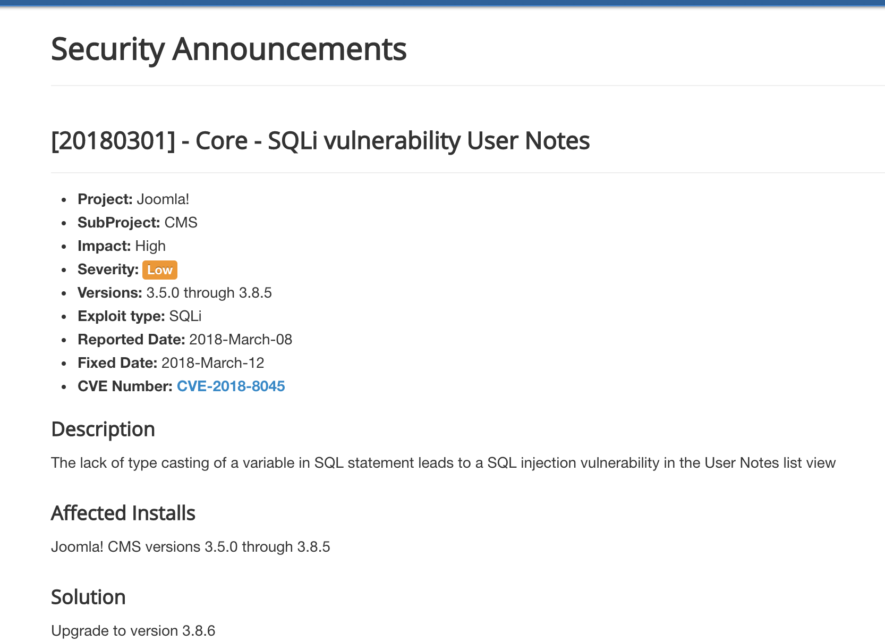

既然3.8.6修复，那就下载了3.8.5和3.8.6,使用Beyond Compare 4进行比对
会话->新建会话->文件夹比较->会话->会话设置->比较
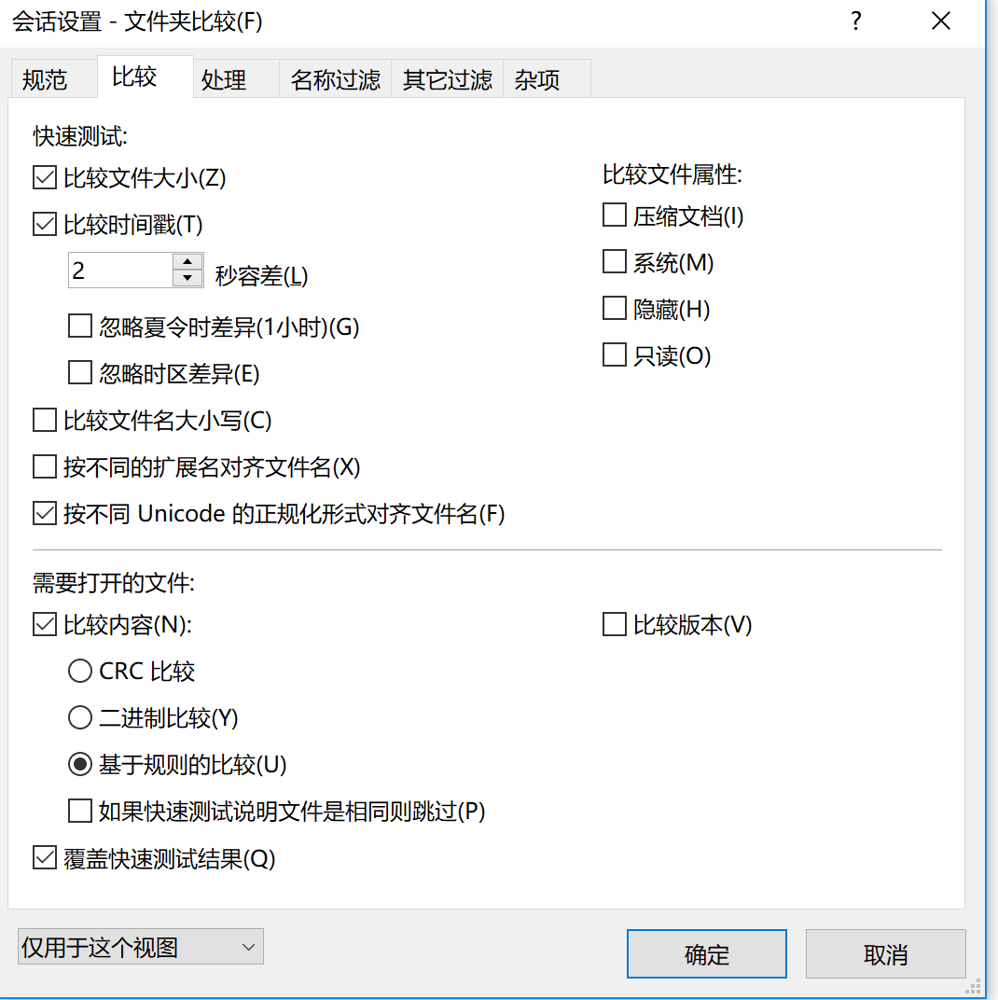


比较一下
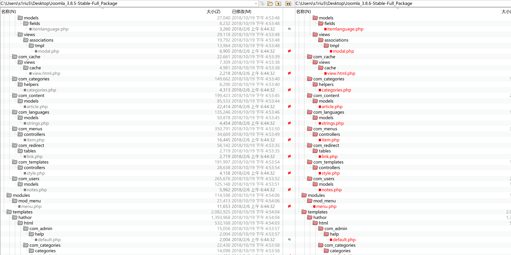


既然是与用户user notes有关，那就搜寻note相关的文件或者是内容
administrator\components\com_users\models\notes.php

然后发现
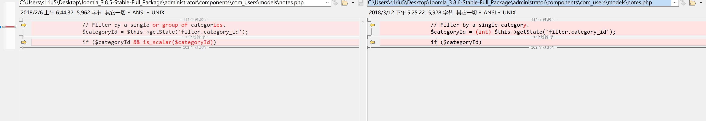
传递的参数被整数化了


漏洞的触发url是http://127.0.0.1/administrator/index.php?option=com_users&view=notes

如果只是打开http://127.0.0.1/administrator/index.php?option=com_users&view=notes  那么执法送一个get请求，没有触发漏洞参数
但是如果选择过滤器
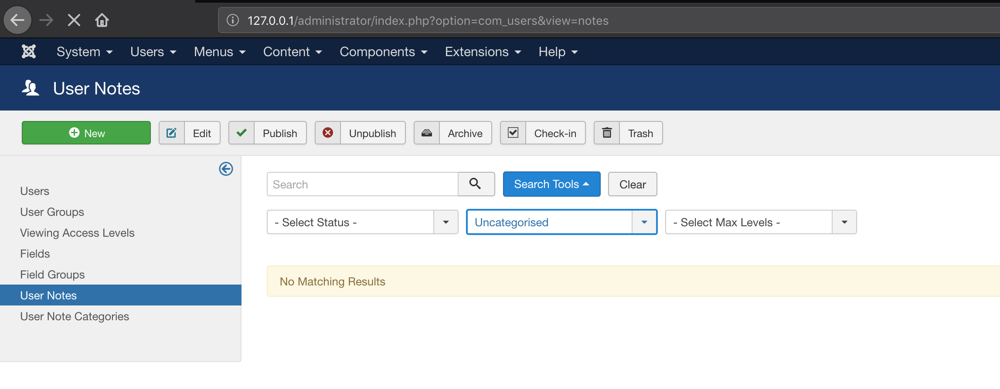

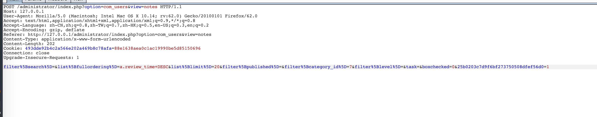
发送的请求中就包含filter[category_id],

在cookie中添加XDEBUG_SESSION=PHPSTORM
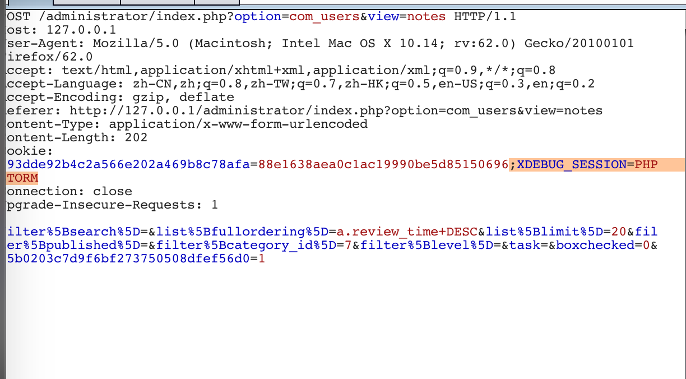

然后设置断点
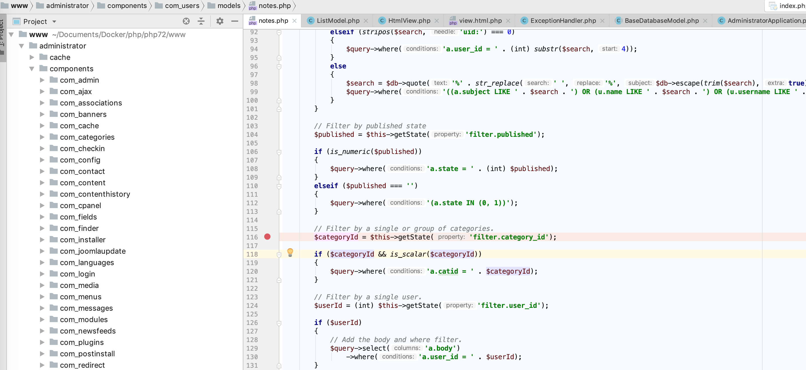

修改一下payload
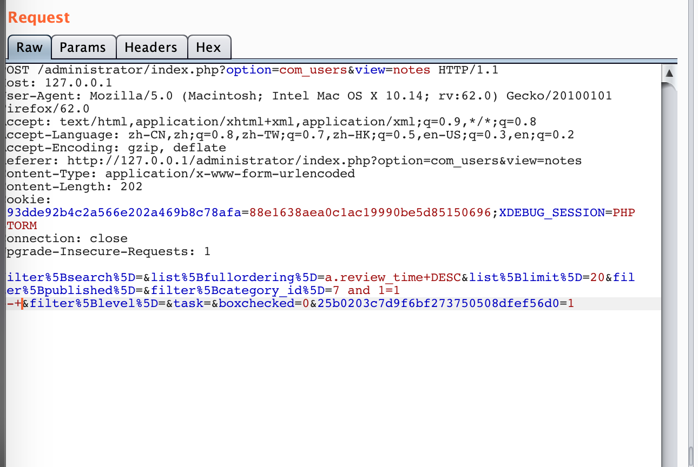

最后百转千回转成的sql语句就是
```sql
SELECT a.id, a.subject, a.checked_out, a.checked_out_time,a.catid, a.created_time, a.review_time,a.state, a.publish_up, a.publish_down,c.title AS category_title, c.params AS category_params,u.name AS user_name,uc.name AS editor
FROM yrgo8_user_notes AS a
LEFT JOIN yrgo8_categories AS c ON c.id = a.catid
LEFT JOIN yrgo8_users AS u ON u.id = a.user_id
LEFT JOIN yrgo8_users AS uc ON uc.id = a.checked_out
WHERE (a.state IN (0, 1)) AND a.catid = 7 and 1=1 --
ORDER BY a.review_time DESC LIMIT 20
```


仍到sqlmap里面
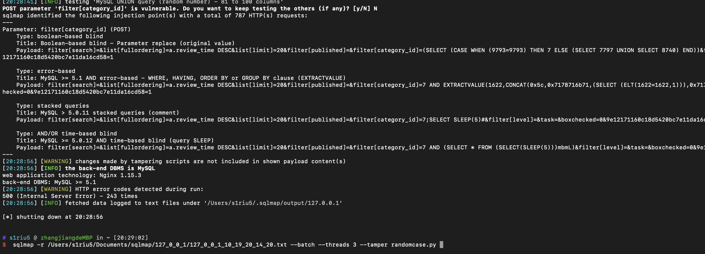

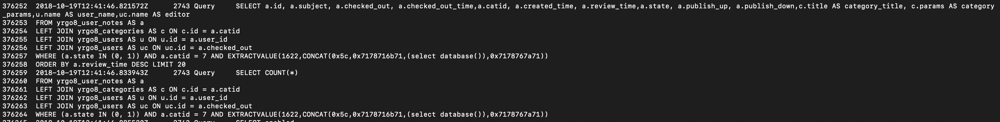


